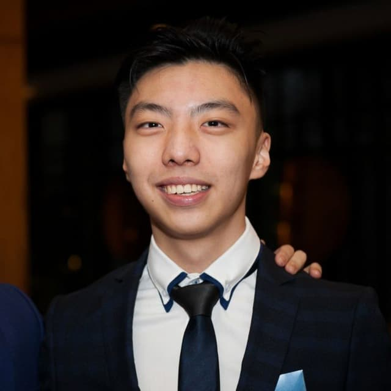
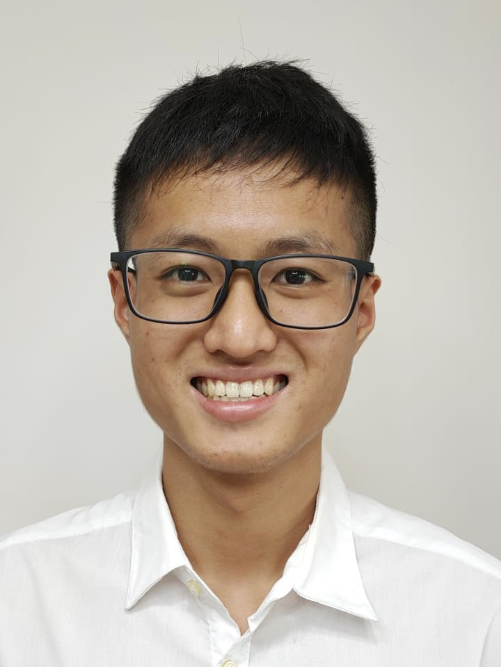
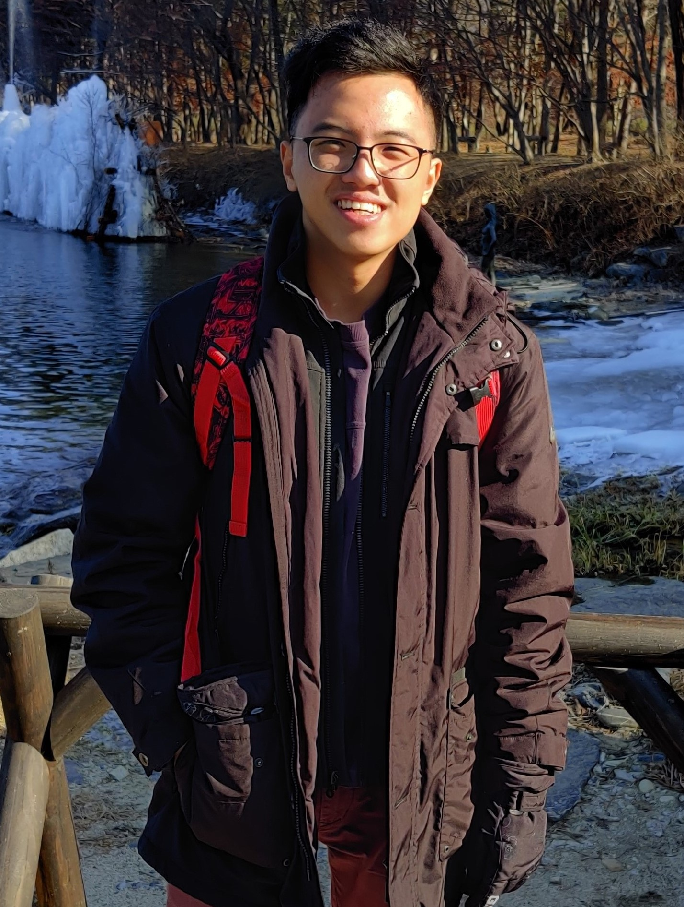

We are a team based in the [School of Computing, National University of Singapore](http://www.comp.nus.edu.sg).

# Project team

### Bernard Wan De Yuan

[[github](https://github.com/bernardwan)]

[[portfolio](team/bernardwan.md)]

Personal email: bernardwan99@gmail.com 
School email: bernardwan@u.nus.edu

Year 2 CS Student
* Role: Deliverables and Deadlines

### Lin Zhiwei

[[github](https://github.com/softmagnet)]

[[portfolio](team/softmagnet.md)]

Personal email: zhiwei3141@gmail.com 
School email: zhiwei_lin@u.nus.edu

Year 2 CS Student
* Role: Code quality and testing

### Ong Zheng Lin

[[github](https://github.com/Ongzl)]

[[portfolio](team/ongzl.md)]

Personal email: ongzhenglin1999@gmail.com 
School email: ong.zhenglin@u.nus.edu

Year 2 CS Student
* Role: Documentation

### Kevin Chua Kian Chun

[[github](https://github.com/yourally2)]

[[portfolio](team/yourally2.md)]

Personal email: kevinchua6@gmail.com 
School email: kevinchua@u.nus.edu

Year 2 CS Student
* Role: Integration
* Subrole: Intellij and Git expert

### Stuart Long Chay Boon

[[github](https://github.com/s7u4rt99)]

[[portfolio](team/s7u4rt99.md)]

Personal email: stuartlongchayboon@gmail.com 
School email: stuartlong@u.nus.edu

Year 2 CS Student
* Role: Team Lead
* Subrole: Scheduling and Tracking
