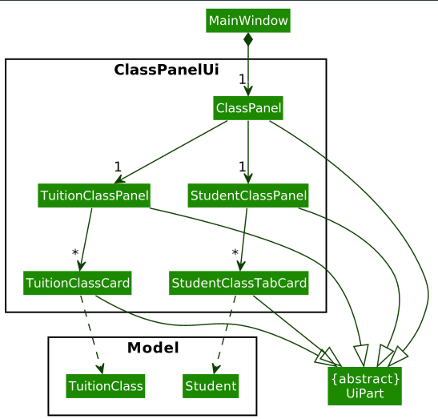
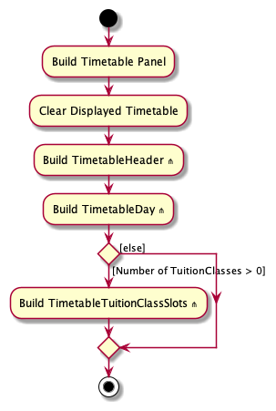
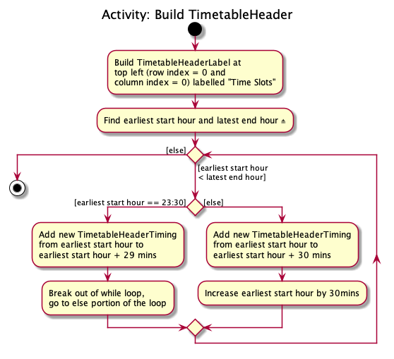
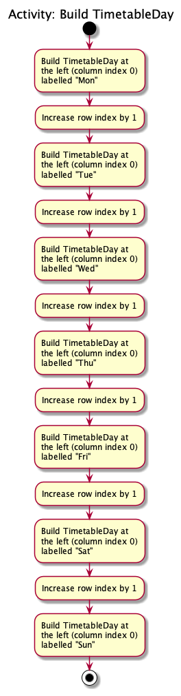
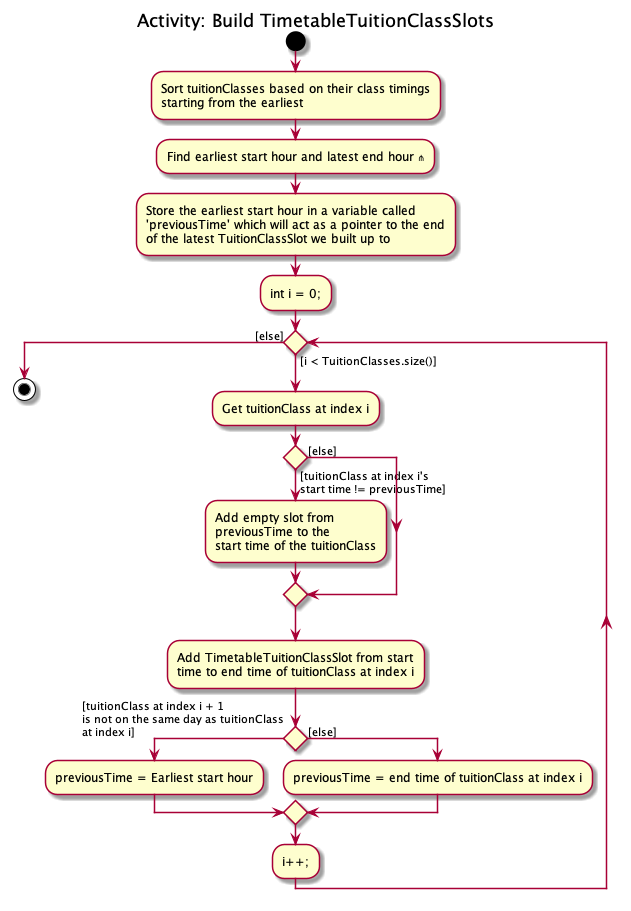
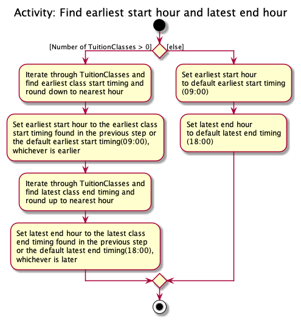

* Table of Contents
{:toc}

--------------------------------------------------------------------------------------------------------------------

## **Acknowledgements**

* Past year projects: [Link](https://github.com/AY1920S2-CS2103-W15-4/main)

--------------------------------------------------------------------------------------------------------------------

## **Setting up, getting started**

Refer to the guide [_Setting up and getting started_](SettingUp.md).

--------------------------------------------------------------------------------------------------------------------

## **Design**

:bulb: **Tip:** The `.puml` files used to create diagrams in this document can be found in the [diagrams](https://github.com/se-edu/addressbook-level3/tree/master/docs/diagrams/) folder. Refer to the [_PlantUML Tutorial_ at se-edu/guides](https://se-education.org/guides/tutorials/plantUml.html) to learn how to create and edit diagrams.

### Architecture

The ***Architecture Diagram*** given above explains the high-level design of the App.

Given below is a quick overview of main components and how they interact with each other.

**Main components of the architecture**

**`Main`** has two classes called [`Main`](https://github.com/se-edu/addressbook-level3/tree/master/src/main/java/seedu/address/Main.java) and [`MainApp`](https://github.com/se-edu/addressbook-level3/tree/master/src/main/java/seedu/address/MainApp.java). It is responsible for,
* At app launch: Initializes the components in the correct sequence, and connects them up with each other.
* At shut down: Shuts down the components and invokes cleanup methods where necessary.

[**`Commons`**](#common-classes) represents a collection of classes used by multiple other components.

The rest of the App consists of four components.

* [**`UI`**](#ui-component): The UI of the App.
* [**`Logic`**](#logic-component): The command executor.
* [**`Model`**](#model-component): Holds the data of the App in memory.
* [**`Storage`**](#storage-component): Reads data from, and writes data to, the hard disk.

**How the architecture components interact with each other**

The *Sequence Diagram* below shows how the components interact with each other for the scenario where the user issues the command `delete 1`.

Each of the four main components (also shown in the diagram above),

* defines its *API* in an `interface` with the same name as the Component.
* implements its functionality using a concrete `{Component Name}Manager` class (which follows the corresponding API `interface` mentioned in the previous point.

For example, the `Logic` component defines its API in the `Logic.java` interface and implements its functionality using the `LogicManager.java` class which follows the `Logic` interface. Other components interact with a given component through its interface rather than the concrete class (reason: to prevent outside component's being coupled to the implementation of a component), as illustrated in the (partial) class diagram below.

The sections below give more details of each component.

### UI component

The **API** of this component is specified in [`Ui.java`](https://github.com/se-edu/addressbook-level3/tree/master/src/main/java/seedu/address/ui/Ui.java)

The UI consists of a `MainWindow` that is made up of parts e.g.`CommandBox`, `ResultDisplay`, `StudentListPanel`, `StatusBarFooter` etc. All these, including the `MainWindow`, inherit from the abstract `UiPart` class which captures the commonalities between classes that represent parts of the visible GUI.

The `UI` component uses the JavaFx UI framework. The layout of these UI parts are defined in matching `.fxml` files that are in the `src/main/resources/view` folder. For example, the layout of the [`MainWindow`](https://github.com/se-edu/addressbook-level3/tree/master/src/main/java/seedu/address/ui/MainWindow.java) is specified in [`MainWindow.fxml`](https://github.com/se-edu/addressbook-level3/tree/master/src/main/resources/view/MainWindow.fxml)

The `UI` component,

* executes user commands using the `Logic` component.
* listens for changes to `Model` data so that the UI can be updated with the modified data.
* keeps a reference to the `Logic` component, because the `UI` relies on the `Logic` to execute commands.
* observes the `Command` abstract class in the `Logic` component, because it needs to update when certain commands are run.
* depends on some classes in the `Model` component, as it displays `Person` object residing in the `Model`.

#### Timetable UI
Adapted from [here](https://github.com/AY1920S2-CS2103-W15-4/main/tree/master/src/main/java/clzzz/helper/ui/calendar)

The TimetablePanel is made up of `TimetableDay`, `TimetableHeader`, `TimetableTuitionClassSlot` and `TimetableEmptySlot`.
They represent the day panel on the left, the header at the top with the label and timings, the slots representing the `TuitionClass`es and the empty slots between `TuitionClass`es respectively.
The TimetablePanel takes in an `ObservableList<TuitionClass>` to build the Timetable.

#### ClassPanel UI
  
The ClassPanel is made up of a `TuitionClassPanel` and a `StudentClassPanel`.  
They represent the left and right panels of the GUI respectively.
`TuitionClassPanel` takes in both an `ObservableList<TuitionClass>` and an `ObservableList<Student>`, while
`StudentClassPanel` takes in only a `ObservableList<Student>`.  
`TuitionClassPanel` requires an `ObservableList<Student>` for the purpose of filtering the Student List based on the selected `TuitionClass`. 
  
`TuitionClassPanel` and `StudentClassPanel` both contain their respective `Card`s for each element in their respective `ObservableList`.   
Note that `StudentClassTabCard` is different from the `StudentCard` in the `studentTab` package so we have less coupling and for future extensibility. 

### Logic component

**API** : [`Logic.java`](https://github.com/se-edu/addressbook-level3/tree/master/src/main/java/seedu/address/logic/Logic.java)

Here's a (partial) class diagram of the `Logic` component:

How the `Logic` component works:
1. When `Logic` is called upon to execute a command, it uses the `TimesTableParser` class to parse the user command.
1. This results in a `Command` object (more precisely, an object of one of its subclasses e.g., `AddCommand`) which is executed by the `LogicManager`.
1. The command can communicate with the `Model` when it is executed (e.g. to add a person).
1. The result of the command execution is encapsulated as a `CommandResult` object which is returned back from `Logic`.

The Sequence Diagram below illustrates the interactions within the `Logic` component for the `execute("delete 1")` API call.

:information_source: **Note:** The lifeline for `DeleteCommandParser` should end at the destroy marker (X) but due to a limitation of PlantUML, the lifeline reaches the end of diagram.

Here are the other classes in `Logic` (omitted from the class diagram above) that are used for parsing a user command:

How the parsing works:
* When called upon to parse a user command, the `TimesTableParser` class creates an `XYZCommandParser` (`XYZ` is a 
  placeholder for the specific command name e.g., `AddCommandParser`) which uses the other classes shown above to 
  parse the user command and create a `XYZCommand` object (e.g., `AddCommand`) which the `TimesTableParser` returns 
  back as a `Command` object.
* All `XYZCommandParser` classes (e.g., `AddCommandParser`, `DeleteCommandParser`, ...) inherit from the `Parser` interface so that they can be treated similarly where possible e.g, during testing.

### Model component
**API** : [`Model.java`](https://github.com/se-edu/addressbook-level3/tree/master/src/main/java/seedu/address/model/Model.java)

The `Model` component,

* stores the TimesTable data.
  * All `Student` objects which are contained in `UniqueStudentList`.
  * All `TuitionClass` objects which are contained in `UniqueClassList`.
* stores the currently 'selected' `Student` objects (e.g., results of a search query) as a separate _filtered_ 
list which is exposed to outsiders as an unmodifiable `ObservableList<Student>` that can be 'observed'
e.g. the UI can be bound to this list so that the UI automatically updates when the data in the list change.
* Similarly, the currently 'selected' `TuitionClass` objects are stored in a separated _filtered_ list which is exposed
to outsiders as an unmodifiable `ObservableList<TuitionClass>`.
* stores a `UserPref` object that represents the user’s preferences. This is exposed to the outside as a `ReadOnlyUserPref` objects.
* does not depend on any of the other three components (as the `Model` represents data entities of the domain, they should make sense on their own without depending on other components).

:information_source: 

**Note about the model design:** 

* Note that `StudentNameList` contains a `List<Name>`.
* Note that the diagram omits the relationship that `Student` and `NOK` are subclasses of the abstract class `Person`.

### Storage component

**API** : [`Storage.java`](https://github.com/se-edu/addressbook-level3/tree/master/src/main/java/seedu/address/storage/Storage.java)

The `Storage` component,
* can save both TimesTable data and user preference data in json format, and read them back into corresponding objects.
* inherits from both `TimesTableStorage` and `UserPrefStorage`, which means it can be treated as either one (if only 
  the functionality of only one is needed).
* depends on some classes in the `Model` component (because the `Storage` component's job is to save/retrieve objects that belong to the `Model`)
* `JsonAdaptedStudent` are saved in a `List<JsonAdaptedStudent>` and `JsonAdaptedTuitionClass` are saved in a 
  `ListJsonAdaptedTuitionClass>`
* `JsonAdaptedTag`s are stored in `JsonAdaptedStudent` as a `List<JsonAdaptedTag>`
  

### Common classes

Classes used by multiple components are in the `seedu.times.commons` package.

--------------------------------------------------------------------------------------------------------------------

## **Implementation**

This section describes some noteworthy details on how certain features are implemented.

### `add` and `edit` commands to include next-of-kin `nok`
This was challenging because the current `Parser` is only able to parse contents _between_ tags, but not encompass other tags within recursively.  
For example, `add n/John Doe p/98765432 e/johnd@example.com a/311, Clementi Ave 2, #02-25 t/Chemistry t/Sec 3
nok/ n/Jack Doe p/10987654 e/jackd@example.com a/311, Clementi Ave 2, #02-25` requires us to parse the tags before and after `nok/` _separately_, which is a challenging problem to think about at first.  

We initially thought of a recursive implementation of the `Parser`, calling `parse` methods again on the two halves whenever we find an `/nok` tag, but 
it proved to be too lofty and unneccesarily complicated. Moreover, using recursion in applications is not recommended due to the high potential 
of unseen bugs.  

Next, we thought of modifying the parser such that it always checks for the `/nok` tag (or any of the tags specified in the parameter) _first_, before parsing the other tags
 in the normal way. However, this was again too large scale for a single command with the same parameter.  

Unexpectedly, the solution that we came up with in the end was very simple. we just had to split the string by `/nok` and put both of the split 
portions into the parser. Modifying the existing `parser` was not needed at all. we learnt that oftentimes for a small feature, we don't have
 to go for the most extensible or "smart" solution, but the simplest to understand.

### Find commands

The implementation of all search-related commands such as `findtag`, `findname`, `findclass` and `findclassname` uses a 
common approach of setting a predicate inside the corresponding `FilteredList` class. As mentioned above in `Model`
section, the filtered list either contains an `ObservableList<Student>` or `ObservableList<TuitionClass>` that is bound to the
UI such that UI is responsive to any changes in the list and these changes can be brought forward by setting a new 
predicate. One should also note that the default predicate always returns a boolean `true` which means no `Person`
or `TuitionClass`is filtered out at the start.

The sequence diagram when a `findtag` command is executed is as follows:

The rest of the find command works the same way but note that for `findclass` and `findclassname`, they are calling the
`setPredicate` method of `filteredTuitionClass` instead.

#### Find command predicates

Furthermore, to fully understand the find command, we also have to understand how predicate works. The predicates used
that filters out students or classes are typical java `Predicate`. For each searchable attribute, a new class must be 
created that implements `Predicate` with the right generic type (i.e. predicate class for filtering `Student` must
implement `Predicate<Student`, and predicate class for filtering `TuitionClass` must implement `Predicate<TuitionClass`).
Each custom predicate class contains a `List` of search strings that would be used to match against the tested items 
in the search.

### Timetable feature
The timetable feature is a feature which displays the user's classes in a visual timetable format.

#### Implementation
The class diagram for Timetable as shown in the [TimetableUI component](#Timetable UI) is replicated here for convenience.

The image below shows the respective parts of the `TimetablePanel`:
* The green box represents the `TimetableDay`, and there are 7 `TimetableDay` parts to represent the 7 days of the week. 
* The yellow box represents the `TimetableHeader`, with the box all the way at the left with the label "Time Slots" representing the `TimetableHeaderLabel`, and the others representing the `TimetableHeaderTiming`. There is always 1 `TimetableHeaderLabel` but can have many `TimetableHeaderTiming` parts depending on the earliest start time of the week and latest end time.
* The purple box represents the `TimetableEmptySlot`.
* The light blue box represents the `TimetableTuitionClassSlot`.

`TimetablePanel` uses an `ObservableList<TuitionClass>` to build the Timetable UI in the timetable tab through the `build()` method in `TimetablePanel` which takes in an `ObservableList<TuitionClass>`.
`TimetablePanel` builds the Timetable UI by sections, starting from the `TimetableHeader`s, followed by the `TimetableDay`s, and finally the `TimetableTuitionClassSlot`s and `TimetableEmptySlot`s simultaneously. 
It sorts the classes in order of class timing (earliest class first) before building the `TimetableTuitionClassSlot`s and `TimetableEmptySlot`s. 

A listener is attached to the `ObservableList<TuitionClass>` which updates the Timetable UI whenever there are changes to the `ObservableList<TuitionClass>`,
such as when a new class is added, or an existing class is edited from the `ObservableList<TuitionClass>`.

[comment]: <> (Due to the limited size of the application's window, the Timetable UI would adjust itself and starts the days of the Timetable UI with the)

[comment]: <> (earliest start timing and ends with the latest end timing so that the timetable is not cluttered. There is a time panel at the top to indicate what)

The activity diagrams below illustrate how the Timetable UI is built.

### Adding a Student to a class
When adding a student, a Class is automatically created if a class at the same timing doesn't already exist.
The AddCommandParse parses the user input to obtain the classTiming (denoted by parameter `/ct`), and
uniquely identifies the class. Afterwards, an AddCommand is created with the `Class` and `Student`, after which
it checks whether an existing class with the same timing exists and adds the student to the `Class`'s classList
and if not, adds the student to the new class created.

### Deleting Tuition Class
To delete a tuition class, the 'deleteclass' command is used.
The DeleteCommandParser parses the user input to obtain the parameters, which is the class timing of the class to be
deleted.
Then, a DeleteCommand is created with the parsed class timing. When the DeleteCommand#execute() is run, the TimesTable
is searched to find the tuition class to be deleted. If no classes matches the ClassTiming, an exception is thrown.
Otherwise, the TuitionClass is obtained. The TuitionClass object stores a list of students in the class in the form
of a list of names. From each name, the respective student is found and the TuitionClass is deleted from the student's
internal class list.
Finally, the TuitionClass itself can be removed from the TimesTable's class list.

A diagram of the procedure is shown below:

### Adding Tuition Class
To add a tuition class, the `addclass` command is used.
The `AddClassCommandParser` parses the user input to obtain 4 parameters: `ClassName`, `ClassTiming`, `Rate` and `Location`. 
The parser checks if the user has inputted valid value for these 4 parameter. These 4 parameters and a new empty 
`StudentNameList` are then used to create a new `TuitionClass` to be passed into a new `AddClassCommand(TuitionClass)` 
as an argument. This command is then executed and the new `TuitionClass` is added into the `Model` and into the 
`UniqueClassList`, where further checks are done to ensure that there is no overlapping timing between the new 
`TuitionClass` that is to be added and other already existing `TuitionClass`es in the list, as TimesTable is made for a
single user and thus designed to not allow overlapping `TuitionClass`es

The sequence diagram when a `AddClass` command is executed by the LogicManager is as follows:

The sequence diagram when a new `TuitionClass` is added to the `Model` is as follows

--------------------------------------------------------------------------------------------------------------------

## **Documentation, logging, testing, configuration, dev-ops**

* [Documentation guide](Documentation.md)
* [Testing guide](Testing.md)
* [Logging guide](Logging.md)
* [Configuration guide](Configuration.md)
* [DevOps guide](DevOps.md)

--------------------------------------------------------------------------------------------------------------------

## **Appendix: Requirements**

### Product scope

**Target user profile**:

* Name: Kevin Bernard Long Zheng Wei
* Age: 28
* Gender: Male
* Marital status: Single
* Country: Singapore
* Habits: Sleeping, Netflix, Gym, Gaming
* Lifestyle: Code, eat, sleep, gives freelance tuition.
    * prefer desktop apps over other types
    * can type fast
    * prefers typing to mouse interactions
    * is reasonably comfortable using CLI apps
* Interest: Loves coding and building apps during his free time with friends. Loves teaching people.
* Values: Work hard play hard.
* Salary: $12000/mth
* Job: Full time freelance A-levels Mathematics tuition teacher (Size of class: group and one-to-one)
    * Has a need to manage a significant number of contacts
* Car: Owns 2 Teslas.
* Home Environment: Lives with parents, older brother and dog.
* Education: NIE graduate.
* Household Description: Sentosa Cove landed property with rich parents.

**Value proposition**:  
A busy tutor who has a large number of students can find it extremely difficult to

* manage and organize student information
* schedule according to student class timing

This is where Timestable comes in. It improves two main areas:
* querying
  * student information
  * parent information
  * class timing
* data manipulation
  * add
  * delete
  * update

By improving the data manipulation process, the tutor can organize student information more easily.  
By improving the querying process, the tutor can make scheduling less painstaking and time-consuming.

### User stories

Priorities: High (must have) - `* * *`, Medium (nice to have) - `* *`, Low (unlikely to have) - `*`

| Priority | As a …​                                    | I want to …​                     | So that I can…​                                                        |
| -------- | ------------------------------------------ | ------------------------------ | ---------------------------------------------------------------------- |
| `* *`    | User                                       | Check if student has paid                                    | Keep track of who I need to remind                         |
| `* * `   | User                                       | Save class rates                                             | Keep track of how much to charge each class                |
| `* * `   | User                                       | Edit my student details                                      | Keep track of changes of my students                       |
| `* * *`  | Forgetful user                             | Save their contacts                                          | I can remember them                                        |
| `* * *`  | User                                       | View my class timings for a specific contact (day and time)  |          Know which day will I be teaching this contact    |
| `* * *`  | User                                       | Record parent contact of my students                         | Contact the student's parent in case of emergencies        |
| `* * *`  | User                                       | Delete/archive my student's contacts and information         | I can declutter my contacts.                               |
| `* * *`  | Experienced User                           | Add all contact details without any specifiers               | I can save time in creating new contacts                   |
| `* * *`  | User                                       | Record locations of classes of each student                  | Knows where to go                                          |
| `* `     | Careless User                              | Be notified if there was a clash in timing                   | I can have peace of mind                                   |
| `* `     | User                                       | View schedule for a specific day                             | Can prepare for lesson and won't be absent                 |

### Use cases

(For all use cases below, the **System** is the `TimesTable` and the **Actor** is the `user`, unless specified otherwise)

**Use case: Delete a student**

**MSS**

1.  User requests to list persons.
2.  TimesTable shows a list of persons.
3.  User requests to delete a specific person in the list.
4.  TimesTable deletes the person.

    Use case ends.

**Extensions**

* 1a. The list is empty.

  Use case ends.

* 3a. The given index is invalid.

    * 3a1. TimesTable shows an error message.

      Use case resumes at step 3.
    
* 3b. The given delete command has a typo.

    * 3b1. TimesTable shows an error message.

      Use case resumes at step 3.

**Use case: Add a student**

**MSS**
1. User input details of new person to be added to TimesTable.
2. TimesTable adds new person with relevant details.

    Use case ends.

**Extension**
* 1a. User keys in add command with invalid format(missing compulsory fields).
  
    * 1a1. TimesTable shows an error message.

      Use case resumes at step 1.
    
* 1b. User keys in add command with valid format but invalid String format for certain field.

    * 1b1. TimesTable shows an error message saying which field contains the invalid format.

      Use case resumes at step 1.

**Use case: Edit student details**

**MSS**
1. User edits details of existing student.
2. TimesTable updates the student with the added details.

   Use case ends.

**Extension**
* 1a. User keys in field with invalid format.
  
    * 1a1. TimesTable shows an error message.

      Use case resumes at step 1.

**Use case: Find student by name**

**MSS**
1. User input name of student that user wants to find.
2. TimesTable shows the student that has the same name.

   Use case ends.

**Extension**
* 1a. No student name matches the name keyword inputted.

    * 1a1. TimesTable shows no student listed.

      Use case ends.

**Use case: Find student by tag**

**MSS**
1. User input tag of student that user wants to find.
2. TimesTable shows the student that has the same tag.

   Use case ends.

**Extension**
* 1a. No student tag matches the tag keyword inputted.

    * 1a1. TimesTable shows no student listed.

      Use case ends.
    
**Use case: Add a tuition class**

**MSS**
1. User input details of new tuition class to be added to TimesTable.
2. TimesTable adds new tuition class with relevant details.

   Use case ends.

**Extension**
* 1a. User keys in addclass command with invalid format(missing compulsory fields).

    * 1a1. TimesTable shows an error message.

      Use case resumes at step 1.
    
* 1b. User keys in addclass command with valid format but invalid String format for certain field.

    * 1b1. TimesTable shows an error message saying which field contains the invalid format.

      Use case resumes at step 1.
    
* 1c. User keys in addclass command with valid format, valid String format for all fields, but class timing overlaps 
  with other classes already in TimesTable.
  
    * 1c1. TimesTable shows an error message saying that this operation would cause a clash in class timing.

      Use case resumes at step 1.

**Use case: Delete a tuition class**

**MSS**

1.  User requests to list classes.
2.  TimesTable shows a list of classes.
3.  User requests to delete a specific class in the list.
4.  TimesTable deletes the class.

    Use case ends.

**Extensions**

* 1a. The list is empty.

  Use case ends.

* 3a. The given index is invalid.

    * 3a1. TimesTable shows an error message.

      Use case resumes at step 3.

* 3b. The given deleteclass command has a typo.

    * 3b1. TimesTable shows an error message.

      Use case resumes at step 3.

**Use case: Add students to a tuition class**

**MSS**
1. User input index of class(in `classes` tab) to be added to and index of students(in `students` tab) to be added.
2. TimesTable adds students selected into class selected.

   Use case ends.

**Extension**
* 1a. User keys in addtoclass command with invalid index(student or class or both).

    * 1a1. TimesTable shows an error message citing which index is invalid.

      Use case resumes at step 1.
    
* 1b. User attempts to add student to a class where the student is already in.

    * 1b1. TimesTable shows an error message saying that student is already in the class.

      Use case resumes at step 1.

**Use case: Remove students from a tuition class**

**MSS**
1. User input index of class(in `classes` tab) to be added to and index of students(in `classes` tab) to be removed.
2. TimesTable removes students from the class selected.

   Use case ends.

**Extension**
* 1a. User keys in removefromclass command with invalid index(student or class or both).

    * 1a1. TimesTable shows an error message citing which index is invalid.

      Use case resumes at step 1.
    
**Use case: Edit tuition class details**

**MSS**
1. User edits details of existing tuition class.
2. TimesTable updates the tuition class with the added details.

   Use case ends.

**Extension**
* 1a. User keys in field with invalid format(wrong field name).

    * 1a1. TimesTable shows an error message.

      Use case resumes at step 1.
    
* 1b. User keys in invalid index.

    * 1b1. TimesTable shows an error message.

      Use case resumes at step 1.
    
* 1c. User keys in class timing that overlaps with other class's class timing.
  
    * 1c1. TimesTable shows an error message saying that this operation would cause a clash in class timing.

      Use case resumes at step 1.

**Use case: Find tuition class by class timing**

**MSS**
1. User input class timing of tuition class that user wants to find.
2. TimesTable shows the tuition classes that has similar class timing.

   Use case ends.

**Extension**
* 1a. No tuition class timing matches the class timing keyword inputted.

    * 1a1. TimesTable shows no tuition classes listed.

      Use case ends.

**Use case: Find tuition class by name**

**MSS**
1. User input name of tuition class that user wants to find.
2. TimesTable shows the tuition class that has similar name.

   Use case ends.

**Extension**
* 1a. No tuition class name matches the name keyword inputted.

    * 1a1. TimesTable shows no tuition class listed.

      Use case ends.  

### Non-Functional Requirements

1.  Should work on any _mainstream OS_ as long as it has Java `11` or above installed.
2.  Should be able to hold up to 1000 persons without a noticeable sluggishness in performance for typical usage.
3.  A user with above average typing speed for regular English text (i.e. not code, not system admin commands) should be able to accomplish most of the tasks faster using commands than using the mouse.
4.  The data should be stored locally in a human editable text file
5.  Should not use a database management system to store data
6.  Should follow OOP paradigm primarily
7.  Should work without requiring an installer
8.  Should not depend on a remote server
9.  Project should simulate a brownfield project by evolving the code base with each iteration incrementally (breadth-first)
10. Should be for a single user
11. Third-party frameworks, libraries and services should be free, open-source, do not require any installation by the user, and do not violate other requirements.
12. GUI should work well for
    * Standard screen resolutions of 1920x1080 and higher
    * Screen scales 100% and 125%
13. GUI should be usable for
    * Resolutions 1280x720 and higher
    * Screen scales 150%
14. Should package everything into a single JAR file
15. Product should not exceed 100 MB and documents should not exceed 15 MB/file
16. Developer Guide and User Guide should be PDF-friendly
*{More to be added}*

### Glossary

* **Mainstream OS**: Windows, Linux, Unix, OS-X
* **Private contact detail**: A contact detail that is not meant to be shared with others

--------------------------------------------------------------------------------------------------------------------

## **Appendix: Instructions for manual testing**

Given below are instructions to test the app manually.

:information_source: **Note:** These instructions only provide a starting point for testers to work on;
testers are expected to do more *exploratory* testing.

### Launch and shutdown

1. Initial launch

   1. Download the jar file and copy into an empty folder

   1. Double-click the jar file Expected: Shows the GUI with a set of sample contacts. The window size may not be optimum.

1. Saving window preferences

   1. Resize the window to an optimum size. Move the window to a different location. Close the window.

   1. Re-launch the app by double-clicking the jar file. 
       Expected: The most recent window size and location is retained.

1. _{ more test cases …​ }_

### Adding a Student to a class
1. Adding a student to a class that doesn't currently exist
    1. Test case: `add n/John Doe p/98765432 e/johnd@example.com a/311, Clementi Ave 2, #02-25 r/70 ct/Mon 11:30-13:30 l/311, Clementi Ave 2, #02-25 t/friends t/owesMoney
       nok/ n/Jack Doe p/10987654 e/jackd@example.com a/311, Clementi Ave 2, #02-25 `
       Expected: A class is created at 11:30-13:30 on Monday.
       Details of the created `Student` and `Class` is shown in the status message.
   List is updated to include the student in the `studentTab` and class is added to the `classTab`

2. Adding a student to a class that currently exists
    1. Test case: `add n/Johnny p/98765432 e/johnd@example.com a/311, Clementi Ave 2, #02-25 r/70 ct/Mon 11:30-13:30 l/311, Clementi Ave 2, #02-25 t/friends t/owesMoney
       nok/ n/Jack Doe p/10987654 e/jackd@example.com a/311, Clementi Ave 2, #02-25 `
       Expected: The student is added to the class that exists at 11:30-13:30 on Monday. No new class is created.
       Details of the created `Student` and the `Class` he is added to is shown in the status message.

### Deleting a person

1. Deleting a person while all persons are being shown

   1. Prerequisites: List all persons using the `list` command. Multiple persons in the list.

   2. Test case: `delete 1` 
      Expected: First contact is deleted from the list. Details of the deleted contact shown in the status message. Timestamp in the status bar is updated.

   3. Test case: `delete 0` 
      Expected: No person is deleted. Error details shown in the status message. Status bar remains the same.

   4. Other incorrect delete commands to try: `delete`, `delete x`, `...` (where x is larger than the list size) 
      Expected: Similar to previous.

3. _{ more test cases …​ }_

## Saving data

1. Dealing with missing/corrupted data files

   1. _{explain how to simulate a missing/corrupted file, and the expected behavior}_

1. _{ more test cases …​ }_
