* Table of Contents 
{:toc}

---

## **Acknowledgements**

- The [`Timetable`](#timetable-ui) feature was inspired by a similar feature in the past project of [Pet Store Helper](https://github.com/AY1920S2-CS2103-W15-4/main).

  The implementation of the components of the [`Timetable`](#timetable-ui) feature (`TimetableTuitionClassSlot`, `TimetableDay`, `TimetableRegion` and `TimetableEmptySlot`) has been adapted from them with maximum changes to fit our app.
  The implementation of how we [built and designed](#timetable-feature) ([TimetablePanel.java](https://github.com/AY2122S1-CS2103T-F11-1/tp/blob/master/src/main/java/seedu/times/ui/timetabletab/TimetablePanel.java)) the entire Timetable Tab (layout, classes etc) is entirely new.

---

## **Setting up, getting started**

Refer to the guide [_Setting up and getting started_](SettingUp.md).

---

## **Design**

:bulb: **Tip:** The `.puml` files used to create diagrams in this document can be found in the [diagrams](https://github.com/AY2122S1-CS2103T-F11-1/tp/tree/master/docs/diagrams) folder. Refer to the [_PlantUML Tutorial_ at se-edu/guides](https://se-education.org/guides/tutorials/plantUml.html) to learn how to create and edit diagrams.

### Architecture

The **_Architecture Diagram_** given above explains the high-level design of the App.

Given below is a quick overview of main components and how they interact with each other.

**Main components of the architecture**

**`Main`** has two classes called [`Main`](https://github.com/AY2122S1-CS2103T-F11-1/tp/blob/master/src/main/java/seedu/times/Main.java) and [`MainApp`](https://github.com/AY2122S1-CS2103T-F11-1/tp/blob/master/src/main/java/seedu/times/MainApp.java). It is responsible for,

- At app launch: Initializes the components in the correct sequence, and connects them up with each other.
- At shut down: Shuts down the components and invokes cleanup methods where necessary.

[**`Commons`**](#common-classes) represents a collection of classes used by multiple other components.

The rest of the App consists of four components.

- [**`UI`**](#ui-component): The UI of the App.
- [**`Logic`**](#logic-component): The command executor.
- [**`Model`**](#model-component): Holds the data of the App in memory.
- [**`Storage`**](#storage-component): Reads data from, and writes data to, the hard disk.

**How the architecture components interact with each other**

The _Sequence Diagram_ below shows how the components interact with each other for the scenario where the user issues the command `delete 1`.

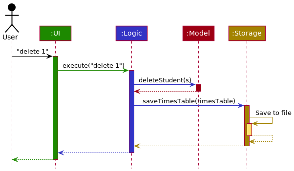

Each of the four main components (also shown in the diagram above),

- defines its _API_ in an `interface` with the same name as the Component.
- implements its functionality using a concrete `{Component Name}Manager` class (which follows the corresponding API `interface` mentioned in the previous point.

For example, the `Logic` component defines its API in the `Logic.java` interface and implements its functionality using the `LogicManager.java` class which follows the `Logic` interface. Other components interact with a given component through its interface rather than the concrete class (reason: to prevent outside component's being coupled to the implementation of a component), as illustrated in the (partial) class diagram below.

The sections below give more details of each component.

### UI component

The **API** of this component is specified in [`Ui.java`](https://github.com/AY2122S1-CS2103T-F11-1/tp/blob/master/src/main/java/seedu/times/ui/Ui.java)

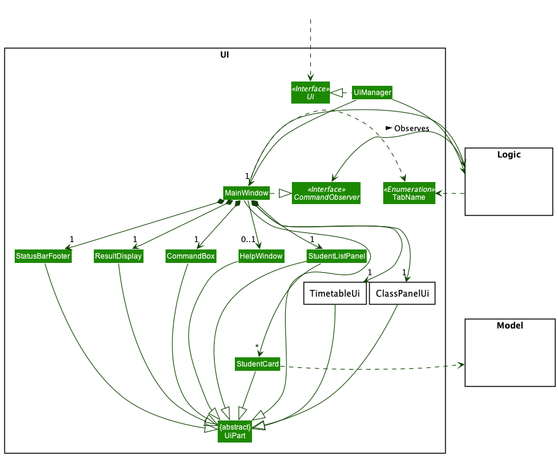

The UI consists of a `MainWindow` that is made up of parts e.g.`CommandBox`, `ResultDisplay`, `StatusBarFooter` etc, and a TabPane consisting of `StudentsUi`, `ClassesUi` and `TimetableUi`. All these, including the `MainWindow`, inherit from the abstract `UiPart` class which captures the commonalities between classes that represent parts of the visible GUI.

The `UI` component uses the JavaFx UI framework. The layout of these UI parts are defined in matching `.fxml` files that are in the `src/main/resources/view` folder. For example, the layout of the [`MainWindow`](https://github.com/AY2122S1-CS2103T-F11-1/tp/blob/master/src/main/java/seedu/times/ui/MainWindow.java) is specified in [`MainWindow.fxml`](https://github.com/AY2122S1-CS2103T-F11-1/tp/blob/master/src/main/resources/view/MainWindow.fxml)

The `UI` component,

- executes user commands using the `Logic` component.
- listens for changes to `Model` data so that the UI can be updated with the modified data.
- keeps a reference to the `Logic` component, because the `UI` relies on the `Logic` to execute commands.
- observes the `Command` abstract class in the `Logic` component, because it needs to update when certain commands are run.
- depends on some classes in the `Model` component, as it displays `Student` and `TuitionClass` objects residing in the `Model`.

#### Students UI

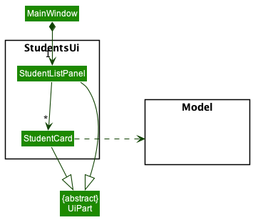

<<<<<<< Updated upstream
The `StudentListPanel` is made up of `StudentCard`s, which displays information about the `Student`s. The `StudentListPanel` takes in an `ObservableList<Student>`, which builds a `StudentCard` for each student.
=======
The `StudentListPanel` consists of `StudentCard`s, which displays information about the `Students`. The `StudentListPanel` takes in an `ObservableList<Student>`, which builds a `StudentCard` for each student.
>>>>>>> Stashed changes

#### Timetable UI

Adapted from [here](https://github.com/AY1920S2-CS2103-W15-4/main/tree/master/src/main/java/clzzz/helper/ui/calendar). You can find more details in the [acknowledgements](#acknowledgements) section.

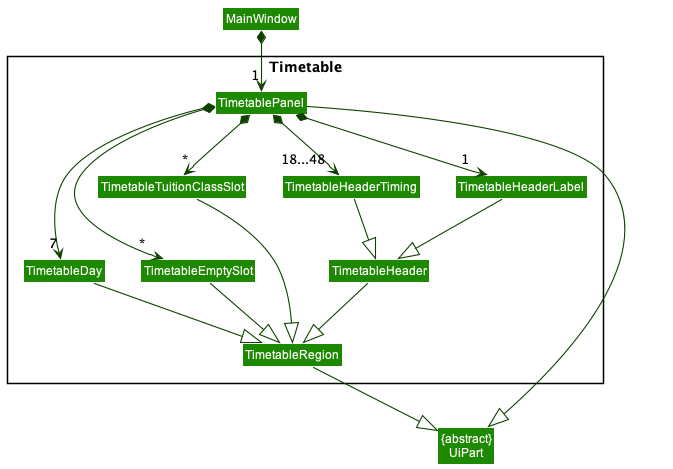

The `TimetablePanel` is made up of `TimetableDay`, `TimetableHeader`, `TimetableTuitionClassSlot` and `TimetableEmptySlot`.
They represent the day panel on the left, the header at the top with the label and timings, the slots representing the `TuitionClass`es and the empty slots between `TuitionClass`es respectively.
The `TimetablePanel` takes in an `ObservableList<TuitionClass>` to build the Timetable.

#### Classes UI

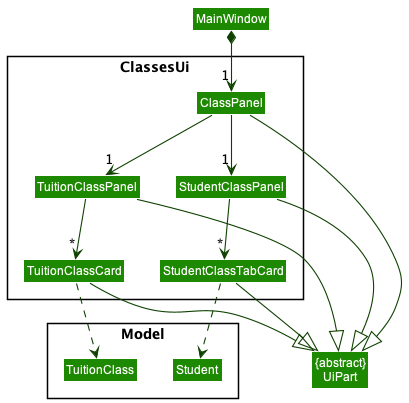

The ClassPanel consists of a `TuitionClassPanel` and a `StudentClassPanel`.  
They represent the left and right panels of the GUI respectively.
`TuitionClassPanel` takes in both an `ObservableList<TuitionClass>` and an `ObservableList<Student>`, while
`StudentClassPanel` takes in only an `ObservableList<Student>`.  
`TuitionClassPanel` requires an `ObservableList<Student>` for the purpose of filtering the Student List based on the selected `TuitionClass`.
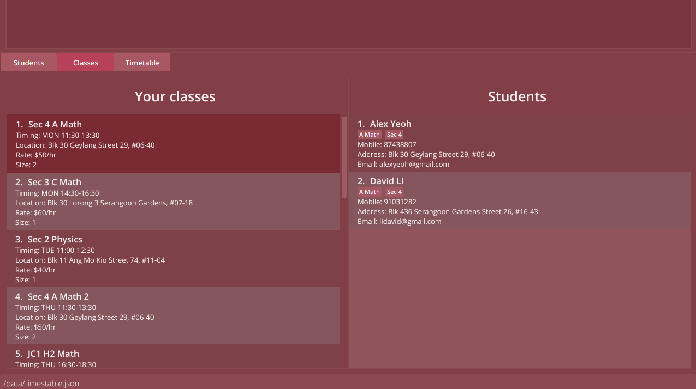  
`TuitionClassPanel` and `StudentClassPanel` both contain their respective `Card`s for each element in their respective `ObservableList`.  
Note that `StudentClassTabCard` is different from the `StudentCard` in the `studenttab` package so we have less coupling and for future extensibility.

### Logic component

**API** : [`Logic.java`](https://github.com/AY2122S1-CS2103T-F11-1/tp/blob/master/src/main/java/seedu/times/logic/Logic.java)

Here's a (partial) class diagram of the `Logic` component:

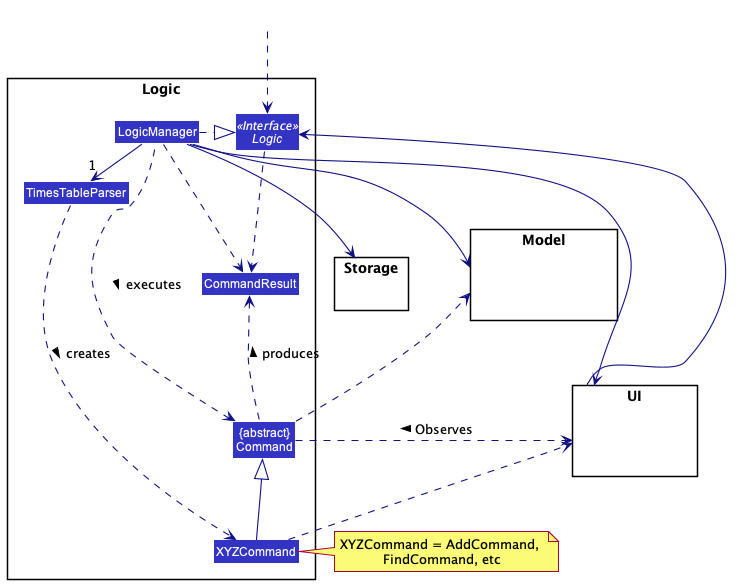

[comment]: <> ()

How the `Logic` component works:

1. When `Logic` is called upon to execute a command, it uses the `TimesTableParser` class to parse the user command.
1. This results in a `Command` object (more precisely, an object of one of its subclasses e.g., `AddCommand`) which is executed by the `LogicManager`. The `Command` object may call the `CommandObserver` to update the `UI` if necessary.
1. The command can communicate with the `Model` when it is executed (e.g. to add a `Student`).
1. The result of the command execution is encapsulated as a `CommandResult` object which is returned back from `Logic`.

The Sequence Diagram below illustrates the interactions within the `Logic` component for the `execute("delete 1")` API call.

:information_source: **Note:** The lifeline for `DeleteCommandParser` should end at the destroy marker (X) but due to a limitation of PlantUML, the lifeline reaches the end of diagram.

Here are the other classes in `Logic` (omitted from the class diagram above) that are used for parsing a user command:

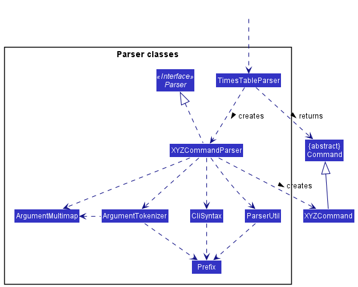

How the parsing works:

- When called upon to parse a user command, the `TimesTableParser` class creates an `XYZCommandParser` (`XYZ` is a
  placeholder for the specific command name e.g., `AddCommandParser`) which uses the other classes shown above to
  parse the user command and create a `XYZCommand` object (e.g., `AddCommand`) which the `TimesTableParser` returns
  back as a `Command` object.
- All `XYZCommandParser` classes (e.g., `AddCommandParser`, `DeleteCommandParser`, ...) inherit from the `Parser` interface so that they can be treated similarly where possible e.g, during testing.

### Model component

**API** : [`Model.java`](https://github.com/AY2122S1-CS2103T-F11-1/tp/blob/master/src/main/java/seedu/times/model/Model.java)

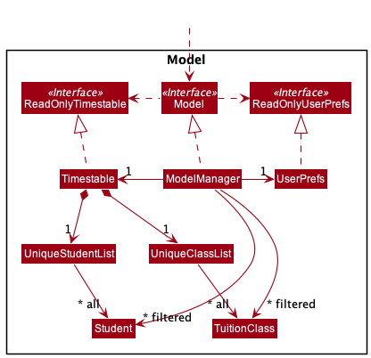

The `Model` component,

- stores the TimesTable data.
  - All `Student` objects which are contained in `UniqueStudentList`.
  - All `TuitionClass` objects which are contained in `UniqueClassList`.
- stores the currently 'selected' `Student` objects (e.g., results of a search query) as a separate _filtered_
  list which is exposed to outsiders as an unmodifiable `ObservableList<Student>` that can be 'observed'
  e.g. the UI can be bound to this list so that the UI automatically updates when the data in the list change.
- Similarly, the currently 'selected' `TuitionClass` objects are stored in a separated _filtered_ list which is exposed
  to outsiders as an unmodifiable `ObservableList<TuitionClass>`.
- stores a `UserPref` object that represents the user’s preferences. This is exposed to the outside as a `ReadOnlyUserPref` objects.
- does not depend on any of the other three components (as the `Model` represents data entities of the domain, they should make sense on their own without depending on other components).

The `Student` and `NOK` class (next-of-kin) extends the `Person` class. The `Student` class's structure is as follows:

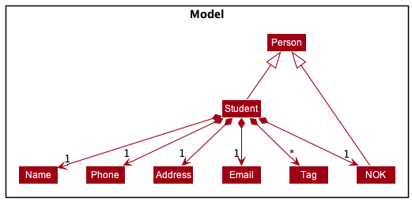

The structure of the `TuitionClass` class is as follows:

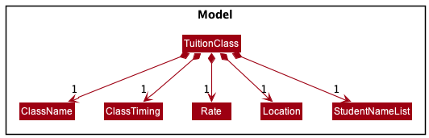

:information_source:

**Note about the model design:** 

The `StudentNameList` contains a `List<Name>`, and the diagram omits the relationship that `Student` and `NOK` are subclasses of the abstract class `Person`.

### Storage component

**API** : [`Storage.java`](https://github.com/AY2122S1-CS2103T-F11-1/tp/blob/master/src/main/java/seedu/times/storage/Storage.java)

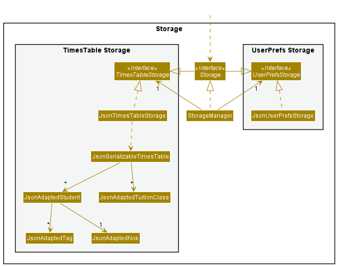

The `Storage` component,

- can save both TimesTable data and user preference data in json format, and read them back into corresponding objects.
- inherits from both `TimesTableStorage` and `UserPrefStorage`, which means it can be treated as either one (if only
  the functionality of only one is needed).
- depends on some classes in the `Model` component (because the `Storage` component's job is to save/retrieve objects that belong to the `Model`).
- `JsonAdaptedStudent` are saved in a `List<JsonAdaptedStudent>` and `JsonAdaptedTuitionClass` are saved in a
  `List<JsonAdaptedTuitionClass>`.
- `JsonAdaptedTag`s are stored in `JsonAdaptedStudent` as a `List<JsonAdaptedTag>`.

### Common classes

Classes used by multiple components are in the `seedu.times.commons` package.

---

## **Implementation**

This section describes some noteworthy details on how certain features are implemented.

### Classes Tab feature

The Classes Tab feature allows one to see the user's classes and each class' corresponding students.

#### Implementation

  
<<<<<<< Updated upstream
The class diagram for the Class Ui feature as shown in the [Classes Ui component](#classes-ui) is replicated here for convenience.  
=======
The class diagram for the Classes Tab feature as shown in the [Classes Ui component](#classes-ui) is replicated here for convenience.  
>>>>>>> Stashed changes
`TuitionClassPanel` and `StudentClassPanel` are both contained in their respective `StackPane` located below their respective `Label`s.

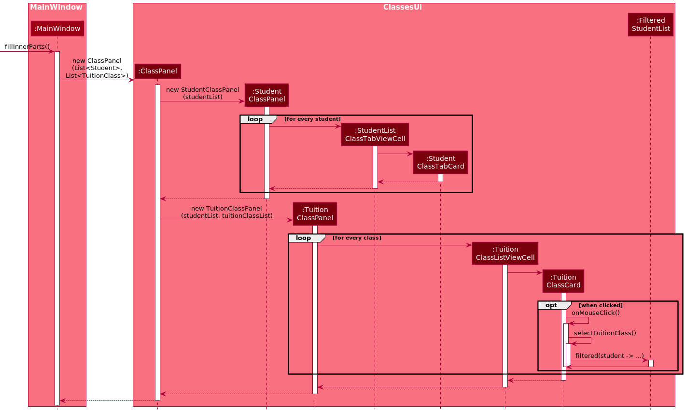

1. `MainWindow#fillInnerParts()` creates a new `ClassPanel` using the `ObservableList<Student>` and the `ObservableList<TuitionClass>` from `Logic`.
2. A `StudentClassPanel` and a `TuitionClassPanel` is created using the `ObservableList<Student>` and `ObservableList<TuitionClass>`.
3. `StudentClassPanel` and `TuitionClassPanel` create their respective cells for each `Student`/`TuitionClass` present.
4. `TuitionClassPanel#setStudentClassList()` is run by taking in the `ListView<Student>` from the `StudentClassPanel`. This is to render the students in the `StudentClassPanel` in the `TuitionClassPanel` as well.
5. Afterwards, when a `TuitionClassCard` is double clicked, `TuitionClassCard#onMouseClick()` bound to the fxml file is called, calling `TuitionClassCard#selectTuitionClass()`.
6. The `filtered` method is then run on the `studentList` to return a `newStudentList` which is filtered by all the students belonging to the `tuitionClass`.
7. The `tuitionClassListView` is set to the `newStudentList` created and thus rendered.

### Timetable Tab feature

The Timetable Tab feature is a feature which displays the user's classes in a visual timetable format.

#### Implementation

The class diagram for Timetable as shown in the [TimetableUI component](#timetable-ui) is replicated here for convenience.

The image below shows the respective parts of the `TimetablePanel`:

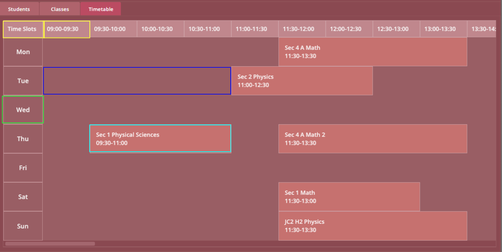

- The green box represents the `TimetableDay`, and there are 7 `TimetableDay` parts to represent the 7 days of the week.
- The yellow box represents the `TimetableHeader`, with the box all the way at the left with the label "Time Slots" representing the `TimetableHeaderLabel`, and the others representing the `TimetableHeaderTiming`. There is always 1 `TimetableHeaderLabel` but can have many `TimetableHeaderTiming` parts depending on the earliest start time and latest end time of the week.
- The dark blue box represents the `TimetableEmptySlot`.
- The light blue box represents the `TimetableTuitionClassSlot`.

[comment]: <> (Due to the limited size of the application's window, the Timetable UI would adjust itself and starts the days of the Timetable UI with the)

[comment]: <> (earliest start timing and ends with the latest end timing so that the timetable is not cluttered. There is a time panel at the top to indicate what)

The sequence diagrams below illustrate how the Timetable UI is built.

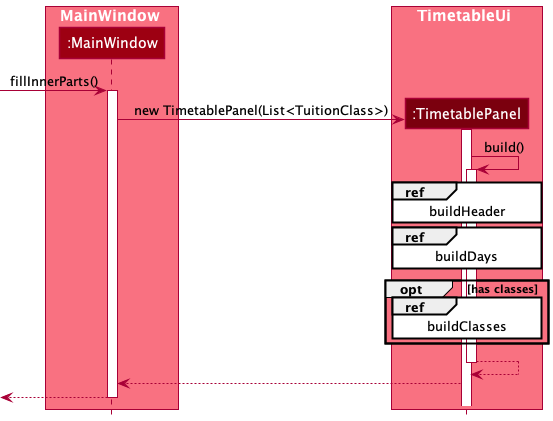

1. `MainWindow#fillInnerParts()` creates a new `TimetablePanel` using the `ObservableList<TuitionClass>` from `Logic`.
2. `TimetablePanel#build()` is called in the constructor of `TimetablePanel` to build the Timetable Ui.
3. `TimetablePanel#build()` starts building the Timetable Ui by first calling `TimetablePanel#buildHeader()` which takes in the `ObservableList<TuitionClass>`.

    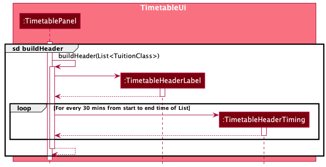

4. Based on the `Timetable#buildHeader()` reference frame above, it builds the `TimetableHeaderLabel` first, followed by the `TimetableHeaderTiming`s, starting from the earliest start time of the `ObservableList<TuitionClass>` until the latest end time of the `ObservableList<TuitionClass>` in 30 minutes interval.

    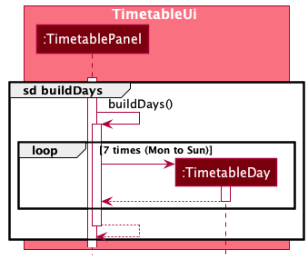

5. After `TimetablePanel#buildHeader()` is called, it would call `TimetablePanel#buildDays()`, which builds 7 `TimetableDay` objects to represent the 7 days of the week.

    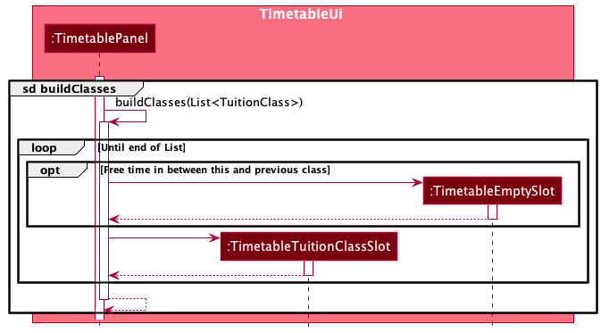

6. Finally, the `TimetablePanel#buildClasses()` is called, which takes in the same `ObservableList<TuitionClass>` as step 3. It iterates through the _sorted_ `ObservableList<TuitionClass>`, building a `TimetableTuitionClassSlot` for each of the `TuitionClass`, and placing `TimetableEmptySlot`s in between the `TimetableTuitionClassSlot`s.
7. A listener is attached to the `ObservableList<TuitionClass>` which updates the Timetable UI whenever there are changes to the `ObservableList<TuitionClass>`,
   such as when a new `TuitionClass` is added, or an existing `TuitionClass` is edited in the `ObservableList<TuitionClass>`.

:information_source: **Note:** This is just a high level explanation of how the Timetable UI is built, with the low level details being abstracted away.

[comment]: <> (![Timetable Overall Activity Diagram]&#40;images/BuildTimetableOverallDiagram.png&#41;)

[comment]: <> (![TimetableHeader Activity Diagram]&#40;images/BuildTimetableHeaderActivityDiagram-Activity\_\_Build_TimetableHeader.png&#41;)

[comment]: <> (![TimetableDay Activity Diagram]&#40;images/BuildTimetableDayActivityDiagram-Activity\_\_Build_TimetableDay.png&#41;)

[comment]: <> (![TimetableTuitionClassSlot Activity Diagram]&#40;images/BuildTimetableTuitionClassSlotsActivityDiagram-Activity\_\_Build_TimetableTuitionClassSlots.png&#41;)

[comment]: <> (![Find earliest start hour and latest end hour Activity Diagram]&#40;images/FindEarliestAndLatestHourActivityDiagram-Activity\_\_Find_earliest_start_hour_and_latest_end_hour.png&#41;)

### Observer Pattern

The Observer Pattern is facilitated by the `CommandObserver` who represents the `Observer`. It observes the abstract `Command` class.

#### Implementation

The class diagram below shows how we implemented the structure of the Observer Pattern.

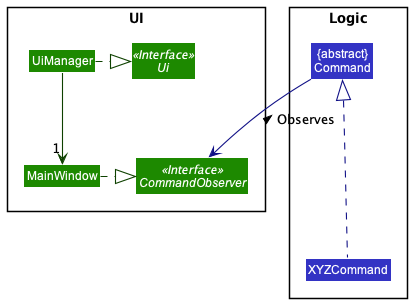

The `MainWindow` from `UI` component implements both the `Ui` and `CommandObserver` interface as it plays the role of the `Ui` as well as a `CommandObserver`. The `MainWindow` observes the `Command` class, who calls `CommandObserver#updateView()`, `CommandObserver#updateClass()` and `CommandObserver#hideTuitionClassList()` depending on what Command `XYZCommand` is.

For eg, the `ViewComand` calls `CommandObserver#updateView()` to set the displayed tab of the `CommandObserver` to the tab specified. Additionally, the `AddToClassCommand` calls both `CommandObserver#updateClass()` and `CommandObserver#updateView()` to update the class details and updates the view to the `Classes` tab when we execute the `AddToClassCommand`.

#### Design Considerations

1. (Bad) After each command call, set a variable in the `CommandResult` to be the value of the Tab to change to, or a boolean value to see if we need to update the class. The `MainWindow` would then check the variables in `CommandResult` in `MainWindow#executeCommand()`, and updates the tab or class accordingly.
   - This is a very bad and inefficient method as the `MainWindow` would have to constantly check the `CommandResult` after every `Command`.
   - With the addition of new variables in `CommandResult`, it has the potential to introduce more bugs and make the code more unreadable. Additionally, other classes may also be able to access these variables accidentally, as they have to be `public` in order for `MainWindow` to access them, leading to unwanted consequences.
2. (Good) Follow the Observer Pattern taught in CS2103T, where we register the `MainWindow` as a `CommandObserver` to observe the abstract `Command` class, and will only get updated when necessary.
   - This is a more efficient method as the `MainWindow` does not have to always check the `CommandResult` after each execution.
   - No new variables are needed to be introduced into the `CommandResult`, keeping our code neater and less bug prone.

### `add` and `edit` commands to include next-of-kin `nok`

#### Implementation
The solution that we came up with was very simple. we just had to split the string by `/nok` and put both of the split
portions into the parser. Modifying the existing `parser` was not needed at all. we learnt that oftentimes for a small feature, we don't have
to go for the most extensible or "smart" solution, but the simplest to understand.

#### Design Considerations
Initially, it appeared challenging to us because the current `Parser` is only able to parse contents _between_ tags, but not encompass other tags within recursively.  
For example, `add n/John Doe p/98765432 e/johnd@example.com a/311, Clementi Ave 2, #02-25 t/Chemistry t/Sec 3 nok/ n/Jack Doe p/10987654 e/jackd@example.com a/311, Clementi Ave 2, #02-25` requires us to parse the tags before and after `nok/` _separately_, which is a challenging problem to think about at first.

1. (Bad) We thought of a recursive implementation of the `Parser`, calling `parse` methods again on the two halves whenever we find an `/nok` tag, but
it proved to be too lofty and unneccesarily complicated. Moreover, using recursion in applications is not recommended due to the high potential
of unseen bugs.

2. (Bad) We thought of modifying the parser such that it always checks for the `/nok` tag (or any of the tags specified in the parameter) _first_, before parsing the other tags
in the normal way. However, this was again too large scale for a single command with the same parameter.

### Find commands

The find commands are a common group of commands that allows users to quickly find `Student` or `TuitionClass`. They are:
* `findname`
* `findtag`
* `findclass`
* `findclassname`

#### Implementation of the command

The implementation of all search-related commands such as `findtag`, `findname`, `findclass` and `findclassname` uses a
common approach of setting a `Predicate` inside the corresponding `FilteredList` class. As mentioned above in [`Model`](#model-component)
section, the filtered list either contains an `ObservableList<Student>` or `ObservableList<TuitionClass>` that is bound to the
UI such that UI is responsive to any changes in the list and these changes can be brought forward by setting a new
`Predicate`. One should also note that the default `Predicate` always returns a boolean `true` which means no `Student`
or `TuitionClass`is filtered out at the start.

The sequence diagram when a `findtag` command is executed is as follows:

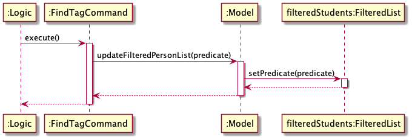

The rest of the find command works the same way but note that for `findclass` and `findclassname`, they are calling the
`setPredicate` method of `filteredTuitionClass` instead.

#### Implementation of find predicates

Furthermore, to fully understand the find command, we also have to understand how `Predicate` works. The `Predicate`s used
that filters out students or classes are typical java `Predicate`. For each searchable attribute, a new class must be
created that implements `Predicate` with the right generic type (i.e. predicate class for filtering `Student` must
implement `Predicate<Student>`, and predicate class for filtering `TuitionClass` must implement `Predicate<TuitionClass>`).
Each custom predicate class contains a `List` of search strings that would be used to match against the tested items
in the search.

### View feature

The `Students` tab, `Classes` tab and `Timetable` tab, are parts of the [`UI Component`](#ui-component).
Navigation between these tabs without the mouse is crucial for our application as the target audience are people who prefer keyboard to mouse or voice commands.

The `view` feature is facilitated by the `ViewCommand`, which extends the abstract `Command` class. The `ViewCommand` sets the displayed tab to be the tab specified by the user.

#### Implementation

The sequence diagram for the `view` command is shown below.

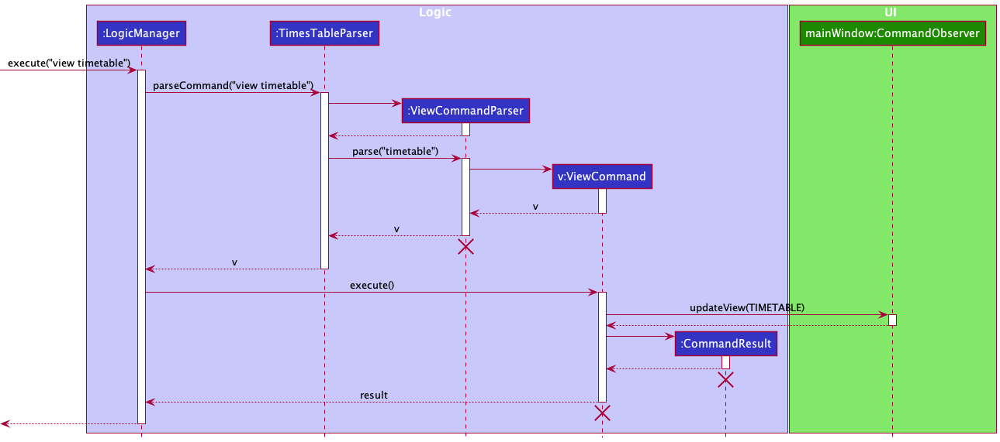

The `ViewCommand` calls the `CommandObserver#updateView(TabName)`, which updates the view of the `CommandObserver`s watching the `Command` abstract class to the `TabName` specified.
In this case, the only `CommandObserver` is the `MainWindow`, thus it updates the view of the `MainWindow` to display the `TIMETABLE` Tab at index 2.

`TabName` is an enumeration which represents the three tabs (`Students`, `Classes`, and `Timetable`), and their respective tab index (0 for `Students`, 1 for `Classes` and 2 for `Timetable`).

### Sort feature

The `sort` feature allows sorting of the `Student`s and `TuitionClass`es. It is able to sort it by `Student` name or `ClassTiming`, in ascending or descending order.

The `sort` feature is facilitated by the `SortCommand`, which extends the abstract `Command` class.

#### Implementation

The sequence diagram for the `sort` command is shown below.

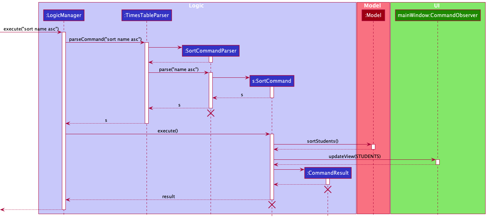

The `sort` command sorts the `ObservableList<Student>` or the `ObservableList<TuitionClass>` in the `Model` component, whose results gets immediately reflected in their respective `Students` tab or `Classes` Tab.
After sorting, the `Command` sets the view to switch to their respective tabs, so that the user would be able to see the changes.

### Adding a Student to a class

`addtoclass` command adds an existing `Student` into an existing `TuitionClass`.

#### Implementation of the parser

`addtoclass` command's parser `AddToClassCommandParser` works by parsing indexes in the user input and
generating a `List<Index>` whereby the first index will be for the `TuitionClass` receiving the `Student`s and the rest
of the index being the `Student`s to be added into the `TuitionClass`. The only thing to note is that the parser
will only see zero and negative indices as invalid and not
out-of-range indices. This is because at the time of parsing, the model is not accessed to check if the indices are
out-of-range. The reason for this design is to reduce dependency and keep to the single responsibility principle. The
job of the parser should be separated from checking in with the model.

#### Implementation of the command

The `addtoclass` command follows an index based format and the `TuitionClass` contains the `Index` of the class to add
the new students to and a `List` of `Index` of students to be added. The command's execution is composed of various
smaller steps. The steps are listed below:

1. Check indices are not out-of-range
2. Generate a list of `Name`s to be added to the class
3. Produce the new student `StudentNameList` based on the class's existing `StudentNameList` and the list of `Name`s to
   be added
4. Creating the right `EditClassDescriptor`
5. Updating the `Model` with updated `TuitionClass`

(Note that updating view action is omitted)

The following sequence diagram gives an overview of the execution:

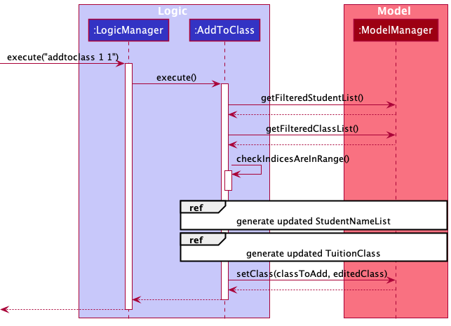

The sequence diagram for the first reference frame from above:

 

The sequence diagram for the second reference frame from above:

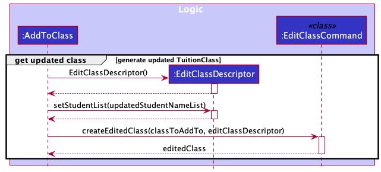

### Removing Student(s) from a Tuition Class
Allows the user to remove one or more `Student`s from a selected `TuitionClass`.

#### Implementation
The `removefromclass` command follows a similar execution path as other commands. The user input is passed to
the `LogicManager`, which parses the input using the `TimesTableParser` and `RemoveFromClassCommandParser`.
A `RemoveFromClassCommand` is then created with the class and student indices involved in the command.
The command is then executed, interacting with the `Model`.

An overview of how the `RemoveFromClassCommand` is created is shown by this sequence diagram:

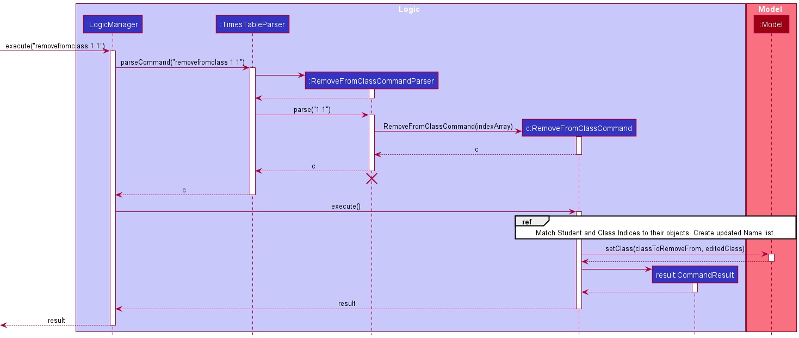

#### Challenges faced

The challenging aspect in removing students from a tuition class is in figuring out which students to remove.

The `RemoveFromClassCommandParser` parses the user input to obtain a list of indexes to be passed to the `RemoveFromClassCommand`.
As such, the `RemoveFromClassCommand` only has access to a list of indices. We can easily obtain the `TuitionClass` object by
simply using the class index with `Model#getFilteredTuitionClassList()`. 

On the other hand, the `TuitionClass` object only stores
the `Name` of each `Student` in the `TuitionClass`. This was done as we use immutable objects throughout TimesTable. As such, if the user
modifies any of the fields of a `Student` using the `edit` command, then we would have to reflect the change throughout all the tuition classes
of the student. By only storing the `Name` of the `Student` in the `TuitionClass` object, then we only have to update all the `TuitionClass`
objects if the user modifies the `Name` field of the `Student`.

However, this decision results in added complexity when removing students from tuition classes. This is due to the fact that the `Name`s
stored in the `TuitionClass` object are in the order in which the students were added, but the order of the students as displayed in the
GUI is dependent on the `sort` and `find` commands used by the user. As such, the indices entered by the user do not correspond with the
actual `Names` stored in the `TuitionClass` object.

To solve this problem, we have to obtain the list of students in the order displayed by the GUI. To obtain this list,
we use the same method that the GUI uses to display the list in the first place. We use `Model#getFilteredStudentList()`,
then filter it to the students whose `Name`s are in the `TuitionClass` that we are concerned with. From here, we can now use the
student indices entered by the user to obtain the `Name`s of the corresponding `Students` in the filtered list. Then we can create
a new `TuitionClass` object with an updated list of `Name`s and replace the old `TuitionClass` with this new one.

An overview of the process is shown below:

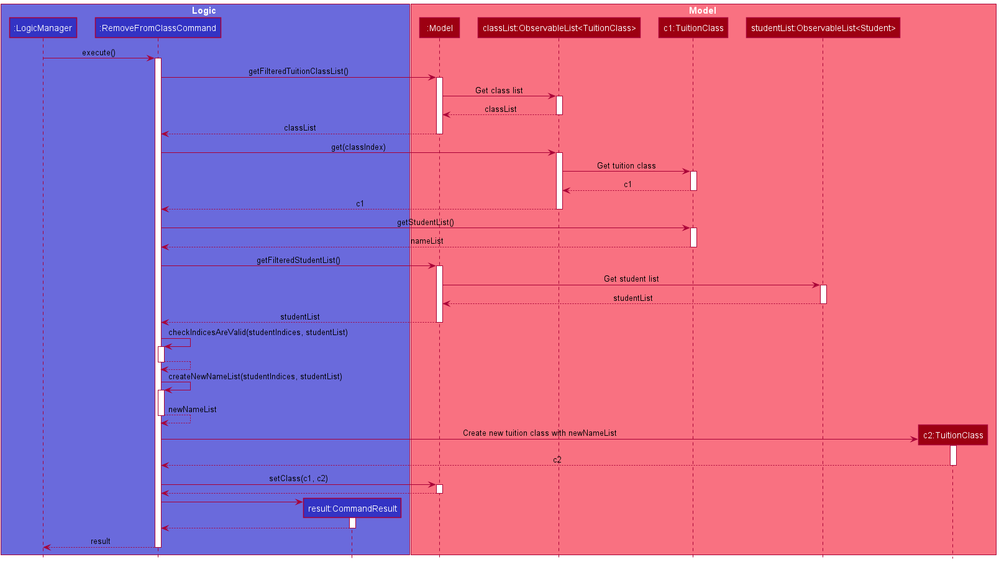

### Deleting Tuition Class

Deletes a `TuitionClass` from the `classes` list in the `Classes` tab, to delete a tuition class, the `deleteclass`
command is used.

#### Implementation

1. The `DeleteCommandParser` parses the user input to obtain the index of the class to be deleted.
2. A `DeleteCommand` is created with the index of the tuition class to be deleted.
3. The `DeleteCommand#execute()` is run, the TimesTable is searched to find the tuition class to be deleted.
4. That tuition class is then deleted from the `Model` and the `UniqueClassList` by extension.

A diagram of the procedure is shown below:

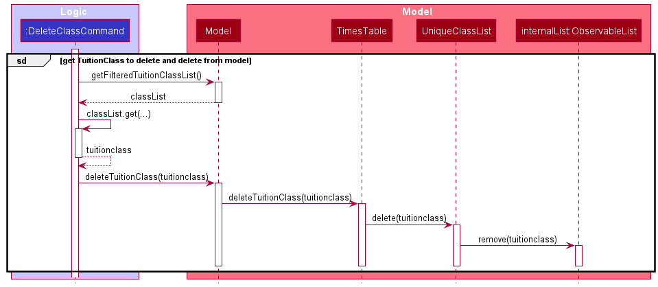

### Adding Tuition Class

Adds a new tuition class into the `classes` list in the `Classes` tab with all the relevant detail, to add a tuition
class, the `addclass` command is used.

#### Implementation

1. The `AddClassCommandParser` parses the user input to obtain 4 parameters: `ClassName`, `ClassTiming`, `Rate` and
   `Location`.
2. The parser checks if the user has inputted valid value for these 4 parameter.
3. These 4 parameters and a new empty`StudentNameList` are then used to create a new `TuitionClass` to be passed into a new `AddClassCommand(TuitionClass)`
   as an argument. 
4. This command is then executed and the new `TuitionClass` is added into the `Model` and into the
   `UniqueClassList`, where further checks are done to ensure that there is no overlapping timing between the new
   `TuitionClass` that is to be added and other already existing `TuitionClass`es in the list, as TimesTable is made for a
   single user and thus designed to not allow overlapping `TuitionClass`es

The sequence diagram when a `AddClass` command is executed by the LogicManager is as follows:

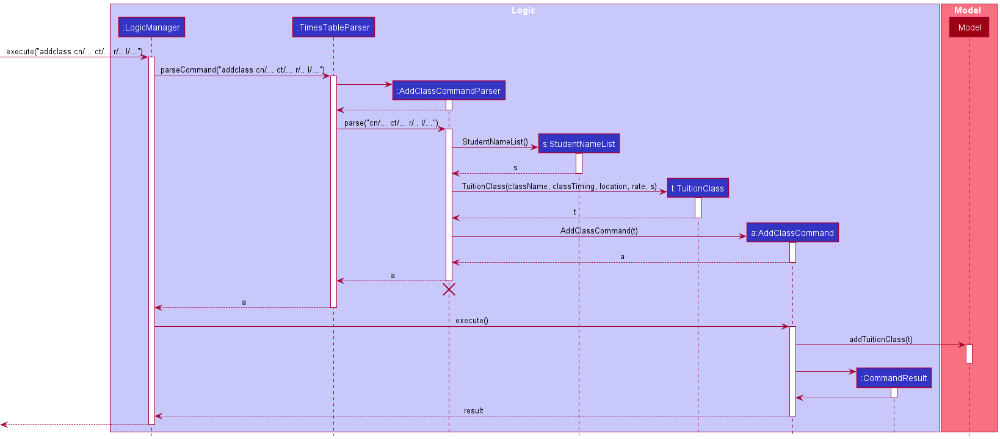

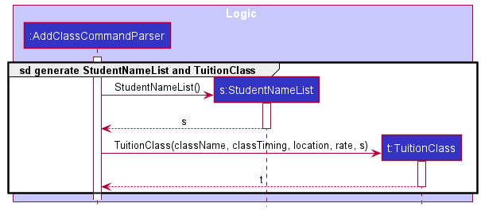

The sequence diagram when a new `TuitionClass` is added to the `Model` is as follows

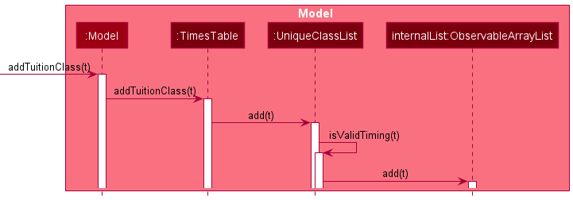

---

## **Documentation, logging, testing, configuration, dev-ops**

- [Documentation guide](Documentation.md)
- [Testing guide](Testing.md)
- [Logging guide](Logging.md)
- [Configuration guide](Configuration.md)
- [DevOps guide](DevOps.md)

---

## **Appendix: Requirements**

### Product scope

**Target user profile**:

- Name: Kevin Bernard Long Zheng Wei
- Age: 28
- Gender: Male
- Marital status: Single
- Country: Singapore
- Habits: Sleeping, Netflix, Gym, Gaming
- Lifestyle: Code, eat, sleep, gives freelance tuition.
  - prefer desktop apps over other types
  - can type fast
  - prefers typing to mouse interactions
  - is reasonably comfortable using CLI apps
- Interest: Loves coding and building apps during his free time with friends. Loves teaching people.
- Values: Work hard play hard.
- Salary: $12000/mth
- Job: Full time freelance A-levels Mathematics tuition teacher (Size of class: group and one-to-one)
  - Has a need to manage a significant number of contacts
- Car: Owns 2 Teslas.
- Home Environment: Lives with parents, older brother and dog.
- Education: NIE graduate.
- Household Description: Sentosa Cove landed property with rich parents.

**Value proposition**:  
A busy tutor who has a large number of students can find it extremely difficult to

- manage and organize student information
- schedule according to student class timing

This is where Timestable comes in. It improves two main areas:

- querying
  - student information
  - parent information
  - class timing
- data manipulation
  - add
  - edit
  - delete

By improving the data manipulation process, the tutor can organize student information more easily.  
By improving the querying process, the tutor can make scheduling less painstaking and time-consuming.

### User stories

Priorities: High (must have) - `* * *`, Medium (nice to have) - `* *`, Low (unlikely to have) - `*`

| Priority | As a …​        | I want to …​                                                | So that I can…​                                     |
| -------- | -------------- | ----------------------------------------------------------- | --------------------------------------------------- |
| `* `     | Careless User  | Be notified if there was a clash in timing                  | I can have peace of mind                            |
| `* `     | User           | View schedule for a specific day                            | Can prepare for lesson and won't be absent          |
| `* *`    | User           | Save class rates                                            | Keep track of how much to charge each class         |
| `* *`    | User           | Edit my student details                                     | Keep track of changes of my students                |
| `* *`    | Organised user | Sort my students and classes                                | Arrange them the way I want to organise them        |
| `* * *`  | Forgetful user | Save their contacts                                         | I can remember them                                 |
| `* * *`  | Organised User | View my class timings in a time table                       | Know how my weekly schedule looks like              |
| `* * *`  | User           | Record parent contact of my students                        | Contact the student's parent in case of emergencies |
| `* * *`  | User           | Delete my student's contacts and information                | I can declutter my contacts.                        |
| `* * *`  | User           | Record locations of classes                                 | Knows where to go                                   |
| `* * *`  | User           | Find a student or class with a specific name                | Find details of a specific class or student quickly |

### Use cases

(For all use cases below, the **System** is the `TimesTable` and the **Actor** is the `user`, unless specified otherwise)

**Use case: Delete a student**

**MSS**

1.  User requests to list students.
2.  TimesTable shows a list of students.
3.  User requests to delete a specific student in the list.
4.  TimesTable deletes the student.

    Use case ends.

**Extensions**

- 1a. The list is empty.

  Use case ends.

- 3a. The given index is invalid.

  - 3a1. TimesTable shows an error message.

    Use case resumes at step 3.

- 3b. The given delete command has a typo.

  - 3b1. TimesTable shows an error message.

    Use case resumes at step 3.

**Use case: Add a student**

**MSS**

1. User input details of new person to be added to TimesTable.
2. TimesTable adds new person with relevant details.

   Use case ends.

**Extension**

- 1a. User keys in add command with invalid format(missing compulsory fields).

  - 1a1. TimesTable shows an error message.

    Use case resumes at step 1.

- 1b. User keys in add command with valid format but invalid String format for certain fields.

  - 1b1. TimesTable shows an error message saying which field contains the invalid format.

    Use case resumes at step 1.

**Use case: Edit student details**

**MSS**

1. User edits details of existing student.
2. TimesTable updates the student with the added details.

   Use case ends.

**Extension**

- 1a. User keys in field with invalid format.

  - 1a1. TimesTable shows an error message.

    Use case resumes at step 1.

**Use case: Find student by name**

**MSS**

1. User input name of student that user wants to find.
2. TimesTable shows the student that has the same name.

   Use case ends.

**Extension**

- 1a. No student name matches the name keyword inputted.

  - 1a1. TimesTable shows no student listed.

    Use case ends.

**Use case: Find student by tag**

**MSS**

1. User input tag of student that user wants to find.
2. TimesTable shows the student that has the same tag.

   Use case ends.

**Extension**

- 1a. No student tag matches the tag keyword inputted.

  - 1a1. TimesTable shows no student listed.

    Use case ends.

**Use case: Add a tuition class**

**MSS**

1. User input details of new tuition class to be added to TimesTable.
2. TimesTable adds new tuition class with relevant details.

   Use case ends.

**Extension**

- 1a. User keys in addclass command with invalid format(missing compulsory fields).

  - 1a1. TimesTable shows an error message.

    Use case resumes at step 1.

- 1b. User keys in addclass command with valid format but invalid String format for certain field.

  - 1b1. TimesTable shows an error message saying which field contains the invalid format.

    Use case resumes at step 1.

- 1c. User keys in addclass command with valid format, valid String format for all fields, but class timing overlaps
  with other classes already in TimesTable.

  - 1c1. TimesTable shows an error message saying that this operation would cause a clash in class timing.

    Use case resumes at step 1.

**Use case: Delete a tuition class**

**MSS**

1.  User requests to list classes.
2.  TimesTable shows a list of classes.
3.  User requests to delete a specific class in the list.
4.  TimesTable deletes the class.

    Use case ends.

**Extensions**

- 1a. The list is empty.

  Use case ends.

- 3a. The given index is invalid.

  - 3a1. TimesTable shows an error message.

    Use case resumes at step 3.

- 3b. The given deleteclass command has a typo.

  - 3b1. TimesTable shows an error message.

    Use case resumes at step 3.

**Use case: Add students to a tuition class**

**MSS**

1. User input index of class(in `classes` tab) to be added to and index of students(in `students` tab) to be added.
2. TimesTable adds students selected into class selected.

   Use case ends.

**Extension**

- 1a. User keys in addtoclass command with invalid index(student or class or both).

  - 1a1. TimesTable shows an error message citing which index is invalid.

    Use case resumes at step 1.

- 1b. User attempts to add student to a class where the student is already in.

  - 1b1. TimesTable shows an error message saying that student is already in the class.

    Use case resumes at step 1.

**Use case: Remove students from a tuition class**

**MSS**

1. User input index of class(in `classes` tab) to be added to and index of students(in `classes` tab) to be removed.
2. TimesTable removes students from the class selected.

   Use case ends.

**Extension**

- 1a. User keys in removefromclass command with invalid index(student or class or both).

  - 1a1. TimesTable shows an error message citing which index is invalid.

    Use case resumes at step 1.

**Use case: Edit tuition class details**

**MSS**

1. User edits details of existing tuition class.
2. TimesTable updates the tuition class with the added details.

   Use case ends.

**Extension**

- 1a. User keys in field with invalid format(wrong field name).

  - 1a1. TimesTable shows an error message.

    Use case resumes at step 1.

- 1b. User keys in invalid index.

  - 1b1. TimesTable shows an error message.

    Use case resumes at step 1.

- 1c. User keys in class timing that overlaps with other class's class timing.

  - 1c1. TimesTable shows an error message saying that this operation would cause a clash in class timing.

    Use case resumes at step 1.

**Use case: Find tuition class by class timing**

**MSS**

1. User input class timing of tuition class that user wants to find.
2. TimesTable shows the tuition classes that has similar class timing.

   Use case ends.

**Extension**

- 1a. No tuition class timing matches the class timing keyword inputted.

  - 1a1. TimesTable shows no tuition classes listed.

    Use case ends.

**Use case: Find tuition class by name**

**MSS**

1. User input name of tuition class that user wants to find.
2. TimesTable shows the tuition class that has similar name.

   Use case ends.

**Extension**

- 1a. No tuition class name matches the name keyword inputted.

  - 1a1. TimesTable shows no tuition class listed.

    Use case ends.

### Non-Functional Requirements

1.  Should work on any _mainstream OS_ as long as it has Java `11` or above installed.
2.  Should be able to hold up to 1000 students without a noticeable sluggishness in performance for typical usage.
3.  A user with above average typing speed for regular English text (i.e. not code, not system admin commands) should be able to accomplish most of the tasks faster using commands than using the mouse.
4.  The data should be stored locally in a human editable text file
5.  Should not use a database management system to store data
6.  Should follow OOP paradigm primarily
7.  Should work without requiring an installer
8.  Should not depend on a remote server
9.  Project should simulate a brownfield project by evolving the code base with each iteration incrementally (breadth-first)
10. Should be for a single user
11. Third-party frameworks, libraries and services should be free, open-source, do not require any installation by the user, and do not violate other requirements.
12. GUI should work well for
    - Standard screen resolutions of 1920x1080 and higher
    - Screen scales 100% and 125%
13. GUI should be usable for
    - Resolutions 1280x720 and higher
    - Screen scales 150%
14. Should package everything into a single JAR file
15. Product should not exceed 100 MB and documents should not exceed 15 MB/file
16. Developer Guide and User Guide should be PDF-friendly

### Glossary

- **Mainstream OS**: Windows, Linux, Unix, OS-X
- **Private contact detail**: A contact detail that is not meant to be shared with others

---

## **Appendix: Instructions for manual testing**

Given below are instructions to test the app manually.

:information_source: **Note:** These instructions only provide a starting point for testers to work on;
testers are expected to do more *exploratory* testing.

### Launch and shutdown

1. Initial launch

   1. Download the jar file and copy into an empty folder

   1. Double-click the jar file Expected: Shows the GUI with a set of sample contacts. The window size may not be optimum.

1. Saving window preferences

   1. Resize the window to an optimum size. Move the window to a different location. Close the window.

   1. Re-launch the app by double-clicking the jar file. 
      Expected: The most recent window size and location is retained.

1. _{ more test cases …​ }_

### Clearing data: `clear`

1. Test case: Clear all `Student`s and `TuitionClass`es in TimesTable.
    1. Prerequisite: TimesTable contains `Student`s and `TuitionClass`es. Steps to do this are below:
        1. (You may skip this if you already have `Student`s) Add a student: `add n/Amber p/98765432 e/johnd@example.com a/311, Clementi Ave 2, #02-25 t/Chemistry t/Sec 3 nok/ n/Jack Doe p/10987654 e/jackd@example.com a/311, Clementi Ave 2, #02-25`
        2. (You may skip this if you already have `TuitionClass`es) Add a class: `addclass cn/Sec 4 A Maths ct/MON 11:30-13:30 r/70 l/Nex Tuition Center`
    2. Clear all data: `clear`
    3. Expected: `TimesTable has been cleared!` and all `Student`s and `TuitionClass`es are removed from TimesTable.

2. Test case: Clear empty TimesTable.
    1. Prerequisite: TimesTable does not contain `Student`s and `TuitionClass`es. Steps to do remove them are below:
        1. (You may skip this if you do not have `Student`s) Delete a student: `delete INDEX` for all `Student`s in TimesTable.
        2. (You may skip this if you do not have `TuitionClass`es) Delete a class: `deleteclass INDEX` for all `TuitionClass`es in TimesTable.
    2. Clear all data: `clear`
    3. Expected: `TimesTable has been cleared!` and all `Student`s and `TuitionClass`es are removed from TimesTable.

### Adding a Student: `add`
1. Test case 1: Add a `Student` successfully
    1. Add a `Student` to TimesTable: `add n/John Doe p/98765432 e/johnd@example.com a/311, Clementi Ave 2, #02-25 t/Chemistry t/Sec 3
       nok/ n/Jack Doe p/10987654 e/jackd@example.com a/311, Clementi Ave 2, #02-25`
     2. Expected message: `New Student added: John Doe; Phone: 98765432; Email: johnd@example.com; Address: 311, Clementi Ave 2, #02-25; Tags: [Chemistry][Sec 3]
       Next-of-Kin: Jack Doe; Phone: 10987654; Email: jackd@example.com; Address: 311, Clementi Ave 2, #02-25`
2. Test case 2: Cannot add duplicate `Student`
    1. Prerequisite: TimesTable contains the sample `Student`s. Steps to do this are below:
        1. Delete `timestable.json` in the data file to start of with the sample data in TimesTable.
    2. Add a `Student` with a clash in `NAME` with an existing `Student`: `add n/Alex Yeoh p/98765432 e/johnd@example.com a/311, Clementi Ave 2, #02-25 t/Chemistry t/Sec 3
       nok/ n/Elise Yeoh p/10987654 e/eliseyeoh@gmail.com a/311, Clementi Ave 2, #02-25`
    3. Expected: `This person already exists in the address book` message shown.

### Adding a class: `addclass`

1. Test case: Adding a `TuitionClass` successfully - no clash in `CLASS_TIMING` with existing `TuitionClass`es.
    1. Prerequisite: TimesTable does not have any `TuitionClass`es. If you have any `TuitionClass`, steps to remove them are below:
        1. (You may skip this if you do not have `TuitionClass`es) Delete a class: `deleteclass INDEX` for all `TuitionClass`es in TimesTable.
    2. Add a `TuitionClass`: `addclass cn/Sec 4 A Maths ct/MON 11:30-13:30 r/70 l/Nex Tuition Center`
    3. Expected: `New class added: Class Timing: MON 11:30-13:30  Class Name: Sec 4 A Maths Location: Nex Tuition Center Rate: 70` and switched to `Classes` Tab. The `Classes` Tab now shows the `TuitionClass` you added. The `Timetable` Tab also shows your `TuitionClass` on `MON 11:30-13:30`.

2. Test case: Adding a `TuitionClass` unsuccessfully - clash in `CLASS_TIMING` with existing `TuitionClass`.
    1. Prerequisite: TimesTable contains the sample `TuitionClass`es. Steps to do this are below:
        1. Delete `timestable.json` in the data file to start of with the sample data in TimesTable.
    2. Add a `TuitionClass` with a clash in `CLASS_TIMING` with an existing `TuitionClass`: `addclass cn/CS2103T ct/MON 10:30-12:30 r/70 l/Nex Tuition Center`
    3. Expected: `The operation aborted because it will introduce a clash in class timing.` and the `TuitionClass` does not get added to the `Classes` Tab.

### Deleting a student: `delete`

1. Test case: Delete a student successfully
    1. Prerequisites: Student to delete must be present. Steps to do this are below:
        1. Add student: `add n/Student p/98765432 e/johnd@example.com a/311, Clementi Ave 2, #02-25 t/Chemistry t/Sec 3 nok/ n/Jack Doe p/10987654 e/jackd@example.com a/311, Clementi Ave 2, #02-25`
        2. Note the students in the student list.
    2. Delete the student: `delete INDEX`. `INDEX` is the index of the student shown in the student list. If there were no other student present before, this would be 1. Otherwise, it would be the number shown at the top left corner of the student card.
    3. Expected: `Deleted Person: Student; Phone: 98765432; Email: johnd@example.com; Address: 311, Clementi Ave 2, #02-25; Tags: [Chemistry][Sec 3] Next-of-Kin: Jack Doe; Phone: 10987654; Email: jackd@example.com; Address: 311, Clementi Ave 2, #02-25` message shown.
       Class no longer belongs in the class list noted in (ia).
1. Test case: Cannot delete a student that doesn't exist
    1. Prerequisites: Student at the student index to be deleted must not exist.
        1. Easiest way to ensure that this happens: run `clear`
        2. Note that the student list is empty.
    2. Delete the student at index 1: `deleteclass 1`.
    3. Expected: `The student index provided is invalid` message shown.

### Deleting a tuition class: `deleteclass`

1. Test case: Deleting a class successfully

    1. Prerequisites: Class to delete must be present. Steps to do this are below:
        1. Add class: addclass cn/Sec 4 A Maths ct/FRI 11:30-13:30 r/70 l/Nex Tuition Center
        2. Note the classes in the class list.

    2. Delete the class: `deleteclass INDEX`. `INDEX` is the index of the class shown in the class list. If there
       were no other classes present before, this would be 1. Otherwise, it would be the number shown at the top left corner of the class card.
       (eg. `deleteclass 1`).

    3. Expected: `Class deleted: Class Timing: FRI 11:30-13:30 Class Name: Sec 4 A Maths Location: Nex Tuition
       Center Rate: 70`  message shown. Class no longer belongs in the class list noted in (ib).

2. Test case: Cannot delete a class that does not exist

    1. Prerequisites: Class at the class index to be deleted must not exist. Steps to do this are below:
        1. Easiest way to ensure that this happens: run clear
        2. Note that the class list is empty.

    2. Delete the class at index 1: `deleteclass 1`.  
    3. Expected: `The class index provided is invalid` message shown.

### Adding a Student to a Class: `addtoclass`

1. Test case 1: Add a `Student` to a `TuitionClass` successfully
   1. Prerequisites: You don't have any `Student`s or `TuitionClass`es. If you have at least _one_ `Student` or `TuitionClass`, you can skip adding a `Student` / `TuitionClass` respectively.
   2. Add a `Student` to TimesTable: `add n/Student p/98765432 e/johnd@example.com a/311, Clementi Ave 2, #02-25 t/Chemistry t/Sec 3 nok/ n/Jack Doe p/10987654 e/jackd@example.com a/311, Clementi Ave 2, #02-25`
   3. Add a `TuitionClass` to TimesTable: `addclass cn/Sec 4 A Maths ct/MON 11:30-13:30 r/70 l/Nex Tuition Center`
   4. Add the `Student` to the `TuitionClass`: `addtoclass 1 1`  
      Expected: `Successfully added students to class` message shown
2. Test case 2: Cannot add to a class that does not exist
   1. Prerequisites: You don't have any classes. If you have any, you can remove them using the `deleteclass INDEX` command or run `clear`.
   2. If you already have a student, you can skip this step.  
      Add a student to TimesTable: `add n/Student p/98765432 e/johnd@example.com a/311, Clementi Ave 2, #02-25 t/Chemistry t/Sec 3 nok/ n/Jack Doe p/10987654 e/jackd@example.com a/311, Clementi Ave 2, #02-25`
   3. Add the student to non-existing class: `addtoclass 1 1`  
      Expected: `The class index provided is invalid` message shown
3. Test case 2: Cannot add to a student that does not exist to a class
   1. Prerequisites: You don't have any students. If you have any, you can remove them using the `delete INDEX` command or run `clear`.
   2. If you already have a class, you can skip this step.  
      Add a class to TimesTable: `addclass cn/Sec 4 A Maths ct/MON 11:30-13:30 r/70 l/Nex Tuition Center`
   3. Add non-existing student to the class: `addtoclass 1 1`  
      Expected: `The student index provided is invalid` message shown

### Removing Student(s) from a class : `removefromclass`

1. Test case: Removing a student from a class that doesn't currently exist
    1. Prerequisites: Class at the class index must not exist. Steps to do this are below:
        1. Run command `listclass` and note the index of the last class.
    2. Remove students from non-existing class at index (max index + 1): `removefromclass 5 1 2 3 `.  
       Where last class is at index 4  from (ib).
    3. Expected: `The class index provided is invalid` message shown.

2. Test case: Removing a student from a class that has no student
    1. Prerequisites: There must be a class with 0 students in it. Steps to do this are below:
        1. Clear TimesTable usiing: `clear`.
        2. Add a new class: `addclass cn/Sec 4 A Maths ct/FRI 11:30-13:30 r/70 l/Nex Tuition Center`.
    2. Remove student(s) from empty class: `removefromclass 1 1 2 3`.
    3. Expected: `The student index provided is invalid` message shown.

### Editing a student: `edit`

1. Test case 1: Editing an existing student's own detail
    1. Prerequisites
        1. Add student: `add n/John p/98765432 e/johnd@example.com a/311, Clementi Ave 2, #02-25 t/Chemistry t/Sec 3 nok/ n/Jack Doe p/10987654 e/jackd@example.com a/311, Clementi Ave 2, #02-25`
        2. Note the student and his or her index in the displayed list in the `Student` tab.
    2. Edit the student (assuming the student's index is 1): `edit 1 n/updated student p/99993293 e/edited@gmail.com a/edited address t/`
    3. Expected: All fields are changed according to `edit` command inputs and all tags are removed.
2. Test case 2: Edit an existing student's NOK detail
    1. Prerequisites: Same as above
    2. Edit the student's NOK (assuming the student's index is 1): `edit 1 nok/ n/edited NOK name e/editedNOK@gmail.com a/edited address p/92393932`
    3. Expected: All NOK fields are changed according to `edit` command inputs
3. Negative test cases
    1. Out of range
        1. (assuming the student list does not have 100 students) enter `edit 100 n/edited name`
        2. Expected: "The student index provided is invalid" is displayed
    2. No fields provided
        1. enter `edit 1`
        2. Expected: "At least one field to edit must be provided." is displayed
    3. invalid prefix provided
        1. enter `edit 1 prefix/`
        2. Expected: Invalid command format message is displayed

### Editing a class: `editclass`

1. Test case 1: Editing an existing class
    1. Prerequisites
        1. Add a class: `addclass cn/Sec 4 A Maths ct/MON 11:30-13:30 r/70 l/Nex Tuition Center`
        2. Note the class and its index in the displayed list in the `Class` tab
    2. Edit the class (assuming the class's index is 1): `editclass 1 cn/edited classname ct/MON 09:00-11:00 r/90 l/edited location`
    3. Expected: All fields are changed according to `editclass` command's inputs
2. Negative test cases:
    1. Out of range
        1. (assuming the class list does not have 100 classes) enter `editclass 100 cn/edited class name`
        2. Expected: "The class index provided is invalid" is displayed
    2. No fields provided
        1. enter `editclass 1`
        2. Expected: "At least one field to editclass must be provided." is displayed
    3. invalid prefix provided
        1. enter `editclass 1 prefix/`
        2. Expected: Invalid command format message is displayed

### Sorting classes and students: `sort`

1. Test case: Sort classes in ascending order.
    1. Prerequisites: Add more than 1 class in non-sorted order by timing. Steps to do this are below:
        1. Add later class first: `addclass cn/Sec 4 A Maths ct/FRI 11:30-13:30 r/70 l/Nex Tuition Center`
        2. Add earlier class second: `addclass cn/Sec 5 A Maths ct/FRI 10:30-11:30 r/70 l/Nex Tuition Center`
        3. Note that 'Sec 4 A Maths' comes _before_ 'Sec 5 A Maths'
    2. Sort classes: `sort timing asc`.
    3. Expected: `Sorted classes based on timing in asc direction` message shown, 'Sec 5 A Maths' now comes _before_ 'Sec 4 A Maths' in the class list.
2. Test case: Sort students in descending order.
    1. Prerequisites: Add more than 1 student in non-sorted order by name. Steps to do this are below:
        1. Add earlier student first: `add n/Amber p/98765432 e/johnd@example.com a/311, Clementi Ave 2, #02-25 t/Chemistry t/Sec 3 nok/ n/Jack Doe p/10987654 e/jackd@example.com a/311, Clementi Ave 2, #02-25 `
        2. Add later student second: `add n/Zebra p/98765432 e/johnd@example.com a/311, Clementi Ave 2, #02-25 t/Chemistry t/Sec 3 nok/ n/Jack Doe p/10987654 e/jackd@example.com a/311, Clementi Ave 2, #02-25 `
        3. Note that 'Amber' comes _before_ 'Zebra'
    2. Sort students: `sort name desc`.
    3. Expected: `Sorted students based on name in desc direction` message shown, 'Zebra' now comes _before_ 'Amber' in the Student list.

### Locating a class by name: `findname`
1. Test case: No students has a name that matches the search term used
    1. Prerequisites: TimesTable contain multiple students. Steps to do this are below:
        1. Delete `timestable.json` in the data file to start off with the sample data in TimesTable.
    2. Find students using a name that currently do not exist: `findname Jennifer`.
    3. Expected: `0 persons listed!` message shown and no students shown in `Students` tab.

2. Test case: A student is found with name that matches search term.
    1. Prerequisites: TimesTable contain multiple students. Steps to do this are below:
        1. Delete `timestable.json` in the data file to start off with the sample data in TimesTable.
    2. Find students using a single name that currently exists: `findname alex`.
    3. Expected: `1 persons listed!` message shown and 2 students shown in `Students` tab, namely `Alex Yeoh` and
       `David Li`.
3. Test case: Multiple students have names that matches search term.
    1. Prerequisites: TimesTable contain multiple students. Steps to do this are below:
        1. Delete `timestable.json` in the data file to start off with the sample data in TimesTable.
    2. Find students using part of a name that currently exists: `findname li`.
    3. Expected: `3 persons listed!` message shown and 3 students shown in `Students` tab, namely
       `Charlotte Oliveiro`, `David Li` and `Angelica Holcomb`.

### Locating a class by name: `findclass`
1. Test case: No `TuitionClass` matches the search term used.
    1. Prerequisite: TimesTable contains the sample `TuitionClass`es. Steps to do this are below:
        1. Delete `timestable.json` in the data file to start of with the sample data in TimesTable.
    2. Find `TuitionClass`es with `CLASS_TIMING` of `WED`: `findclass WED`
    3. Expected: `0 classes listed!` and tab switched to `Classes` tab.

2. Test case: `TuitionClass`es match the search term used.
    1. Prerequisite: TimesTable contains the sample `TuitionClass`es. Steps to do this are below:
        1. Delete `timestable.json` in the data file to start of with the sample data in TimesTable.
    2. Find `TuitionClass`es with `CLASS_TIMING` of 'MON': `findclass mon`
    3. Expected: `2 classes listed!` and tab switched to `Classes` tab. The `Classes` Tab contains 2 `TuitionClass`es with `CLASS_TIMING` of `MON`.

3. Test case: `TuitionClass`es match the multiple search terms used.
    1. Prerequisite: TimesTable contains the sample `TuitionClass`es. Steps to do this are below:
        1. Delete `timestable.json` in the data file to start of with the sample data in TimesTable.
    2. Find `TuitionClass`es with `CLASS_TIMING` of `MON` and `11:30-13:30`: `findclass mon 11:30-13:30`
    3. Expected: `1 classes listed!` and tab switched to `Classes` tab. The `Classes` Tab contains 1 `TuitionClass` with `CLASS_TIMING` of `MON` and `11:30-13:30`.

### Locating a class by name: `findclassname`

1. Test case: No `TuitionClass` matches the search term used.
    1. Prerequisite: TimesTable contains the sample `TuitionClass`es. Steps to do this are below:
        1. Delete `timestable.json` in the data file to start of with the sample data in TimesTable.
    2. Find `TuitionClass`es with `CLASS_NAME` of `CS2103T`: `findclassname CS2103T`
    3. Expected: `0 classes listed!` and tab switched to `Classes` tab.

2. Test case: `TuitionClass`es match the search term used.
    1. Prerequisite: TimesTable contains the sample `TuitionClass`es. Steps to do this are below:
        1. Delete `timestable.json` in the data file to start of with the sample data in TimesTable.
    2. Find `TuitionClass`es with `CLASS_NAME` of 'math': `findclassname math`
    3. Expected: `7 classes listed!` and tab switched to `Classes` tab. The `TuitionClass`es shown in the `Classes` Tab contains 7 `TuitionClass`es with `CLASS_NAME` of `math` (case insensitive).

3. Test case: `TuitionClass`es match the multiple search terms used.
    1. Prerequisite: TimesTable contains the sample `TuitionClass`es. Steps to do this are below:
        1. Delete `timestable.json` in the data file to start of with the sample data in TimesTable.
    2. Find `TuitionClass`es with `CLASS_NAME` of `math` and `jc`: `findclassname math, jc`
    3. Expected: `8 classes listed!` and tab switched to `Classes` tab. The `TuitionClass`es shown in the `Classes` Tab contains 8 `TuitionClass`es with `CLASS_NAME` of `math` or `jc` or both (case insensitive).

### Finding Student(s) by tag : `findtag`

1. Test case: No students have tags that matches the search term used
    1. Prerequisites: TimesTable contain multiple students with differing tags. Steps to do this are below:
        1. Delete `timestable.json` in the data file to start off with the sample data in TimesTable.
    2. Find students using tag that currently do not exist: `findtag social studies`.
    3. Expected: `0 persons listed!` message shown and no students shown in `Students` tab.

2. Test case: Students have tags that matches search term(single)
    1. Prerequisites: TimesTable contain multiple students with differing tags. Steps to do this are below:
        1. Delete `timestable.json` in the data file to start off with the sample data in TimesTable.
    2. Find students using a single tag that currently exists: `findtag a math`.
    3. Expected: `2 persons listed!` message shown and 2 students shown in `Students` tab, namely `Alex Yeoh` and
       `David Li`.
3. Test case: Students have tags that matches search terms(multiple)
    1. Prerequisites: TimesTable contain multiple students with differing tags. Steps to do this are below:
        1. Delete `timestable.json` in the data file to start off with the sample data in TimesTable.
    2. Find students using multiple tag that currently exists: `findtag a math, physic, sec 4`.
    3. Expected: `4 persons listed!` message shown and 2 students shown in `Students` tab, namely `Alex Yeoh`,
       `Charlotte Oliveiro`, `David Li` and `Illana Page`.

### Changing tabs: `view`

1. Test case: View `Classes` tab, but command has a typo error
    1. View `Classes` tab with typo: `view clases`.
    2. Expected: `Invalid command format!This tab doesn't exists. You can only switch to students, timetable or
       classes.` message show.

2. Test case: View `Classes` tab, but user is already on `Classes` tab
    1. View `Classes` tab: `view classes`.
    2. Expected: `Successfully switched to CLASSES tab` and remains on `Classes` tab.

3. Test case: View `Timetable` tab, user is on `Classes` tab
    1. View `Timetable` tab: `view timetable`.
    2. Expected: `Successfully switched to TIMETABLE tab` and switched to `TimeTable` tab.

### Selecting a class: `class`
1. Test case 1: viewing an existing class
    1. Prerequisites
        1. Add a class: `addclass cn/Sec 4 A Maths ct/MON 11:30-13:30 r/70 l/Nex Tuition Center`
        2. Note the class and its index in the displayed list in the `Class` tab
        3. Adding students to the class (assuming the class's index is 1 and there are at least 2 students in Timestable): `addtoclass 1 1 2 `
    2. view the class (assuming the class's index is 1): `class 1`
    3. Expected: the students list in `Classes` tab is showing students belonging to that class
2. Negative test cases:
    1. Out of range
        1. (assuming the class list does not have 100 classes) enter `class 100`
        2. Expected: "The class index provided is invalid" is displayed

### Listing all students: `list`

1. Test case: All `Student`s are listed and focus is moved to the `Students` tab. All previous filtering is reset.
    1. Prerequisite: `Student` filter must be present. Steps to do this are below:
        1. Delete `timestable.json` in the data file to start of with the sample data in TimesTable.
    2. Filter `Student`s: `findname alex`. One `Student` with the name `Alex Yeoh` should be listed.
    3. Go to `Classes` tab: `view classes`
    4. List all `Student`s: `list`
    5. Expected: `Listed all students` message shown and tab is changed to the `Students` tab. The list of `Student`s should be the same as before filtering (Step 2).

### Listing all classes: `listclass`

1. Test case: All `TuitionClass`es are listed and focus is moved to `Classes` tab. All previous filtering is reset.
   1. Prerequisites: `TuitionClass` to filter must be present. Steps to do this are below:
      1. Add `TuitionClass`: `addclass cn/Sec 4 A Maths ct/FRI 11:30-13:30 r/70 l/Nex Tuition Center`
      2. Note the `TuitionClass`es in the class list.
   2. Filter classes: `findclassname hello`. No `TuitionClass`es should be listed.
   3. Go to `Students` tab: `view students`
   4. List `TuitionClass`es: `listclass`
   5. Expected: `Listed all classes` message shown and tab is moved to `Classes` tab. Class list noted in (ib) is shown.
