## Introduction

**TimesTable** is a **tuition management** desktop app for tutors who prefer to use a Command Line Interface (CLI) over a
Graphical User Interface (GUI). **TimesTable** allows you to manage and keep track of your tuition students and classes.
The app stores basic information about your students and classes, such as `Name`, `Email`, `Address`, `Class Timing`, and more.
You can add the students to classes to organise them. 

**TimesTable** also automatically generates a TimeTable for you based on your created classes so you can visualise
your schedule at a glance.

**TimesTable** uses the CLI to enter commands, which means you control the application by typing in commands into the
command box. Other GUI applications are controlled by clicking on buttons and boxes. 
If you can type fast, TimesTable can get your class management tasks done faster than traditional GUI applications.
Using the CLI allows you to control the application quickly while still having the visual benefits of a GUI.

This guide will take you through the commands of **TimesTable** step by step. For more information about how to use the
guide, head to the [Reading this User Guide](#reading-this-user-guide) section. To get started with using **TimesTable**,
jump to the [Quick Start](#quick-start) section. For a full list of commands and detailed instructions on each one, head to the
[Features](#features) section.

## Table of Contents
* Table of Contents
{:toc}

--------------------------------------------------------------------------------------------------------------------

## Quick Start
### Set Up

1. Ensure you have Java `11` or above installed in your Computer, if you do not, you can download it from [here](https://www.oracle.com/java/technologies/downloads/#java11-windows).

2. Download the latest `timestable.jar` from [here](https://github.com/AY2122S1-CS2103T-F11-1/tp/releases).
   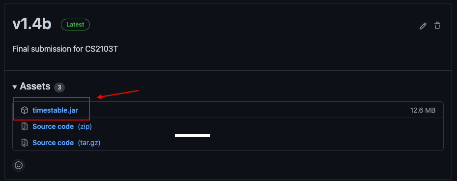
3. Copy the file to the folder you want to use as the _home folder_ for your TimesTable.
   

4. For `Windows`, double-click the file to start the app.
   For `Mac`, you need to open `TimesTable` using terminal. You can right-click on the folder and click on New Terminal at Folder to bring up your terminal, and key in `java -jar timestable.jar`. Press Enter to launch the application.
    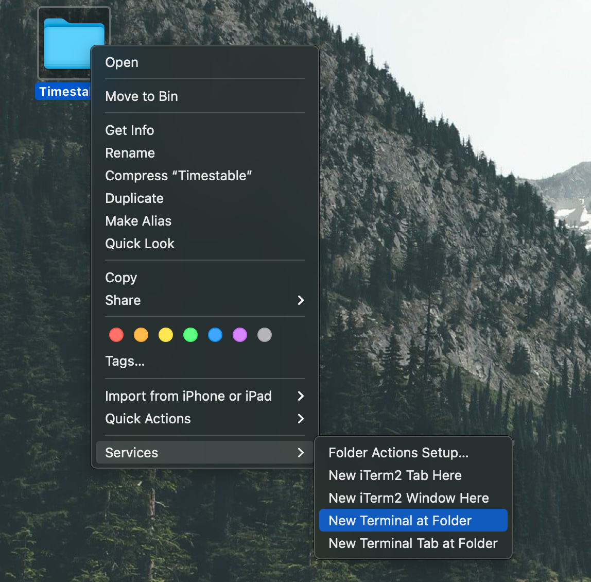 
   

5. The GUI similar to the below should appear in a few seconds. Note how the app contains some sample student data. 
   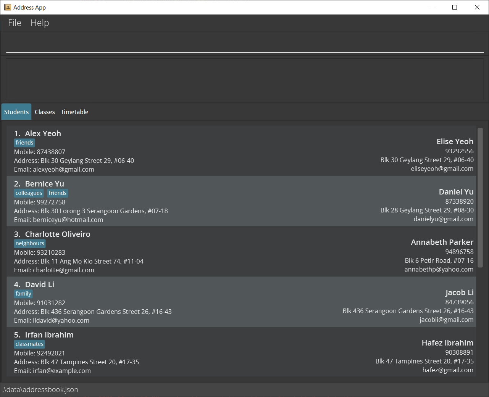
   

### Tutorial

1. Before we begin, note that we are at the Students Tab, where we show all the students that you are teaching. Other tabs will be explained later.  
2. To get started, lets add a student using the [`add`](#adding-a-student-add) command.
First type `add n/John Doe p/98765432 e/johnd@example.com a/John street, block 123, #01-01 nok/ n/Jack Doe p/10987654 e/jackd@example.com a/311, Clementi Ave 2, #02-25` 
into the command box to add 'John Doe' using the parameter `n/`, with his specified phone number using the `p/` parameter, and email using the `e/` parameter and so on (for more details refer to the [`add`](#adding-a-student-add) command). If you're wondering, the text after 
`nok/` specifies all the information for his _next-of-kin_, and uses the similar parameters.
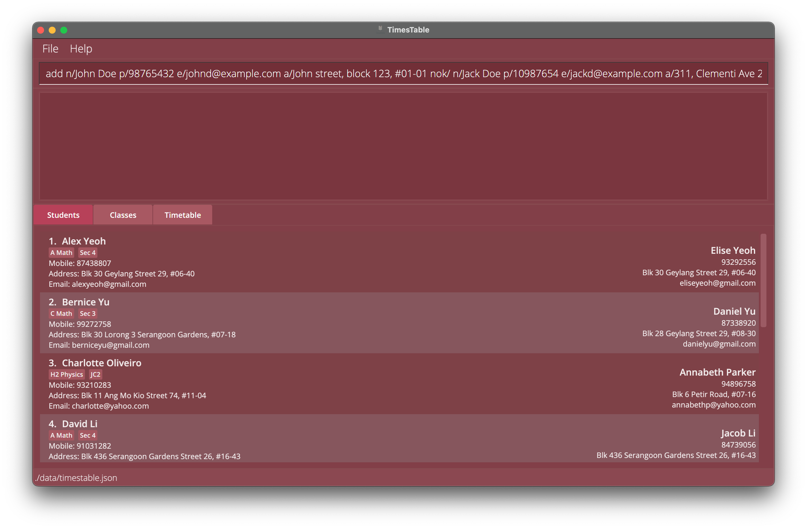  
Press enter afterwards to execute the command which adds a student to our TimesTable.
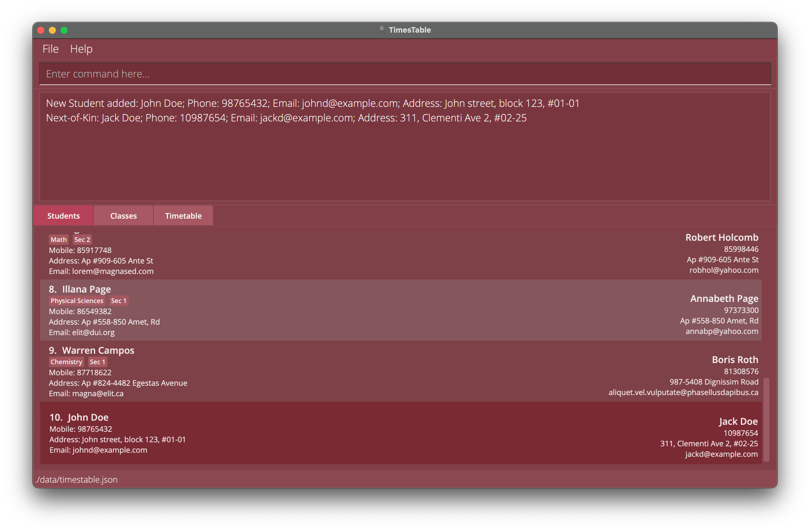

3. Next, we can try creating a class! Similar to before, we run the [`addclass`](#adding-a-class-addclass) command.  
Type `addclass cn/Sec 4 A Maths ct/FRI 11:30-13:30 r/70 l/Nex Tuition Center` into the command box.  
We are adding a class 'Sec 4 A Maths' using the `cn/` parameter, at 11:30am to 1:30pm using the `ct/` parameter, together with the rate and the location.    
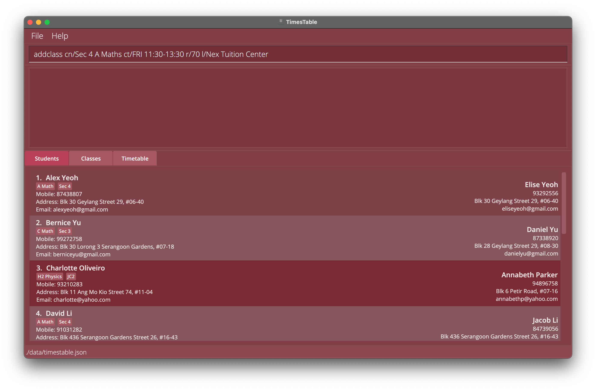
Again, press enter to add the class to our TimesTable.
   

4. Oh! Notice that you have been transported to another tab. This is known as the Classes Tab, 
which shows you all the information about the Classes you are teaching.  
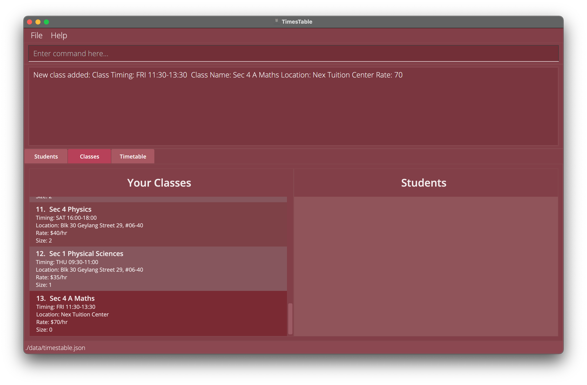
When we scroll down, you can see that 'Sec 4 A Maths' is added at the bottom.

5. See that blank space on the right? It is where all the students who are under that class go to.  
I will now show you how to add students to a class! Here, we are using the [`addtoclass`](#adding-studentstudents-to-a-class-addtoclass) 
command, which takes in the index of the class, followed by the indexes of the students.   
Type `addtoclass 13 10` to add the student that you just added (in index 10) to the class that you just added (in index 13).  
As shown, you can see the students that are added to the class. How cool is that?   
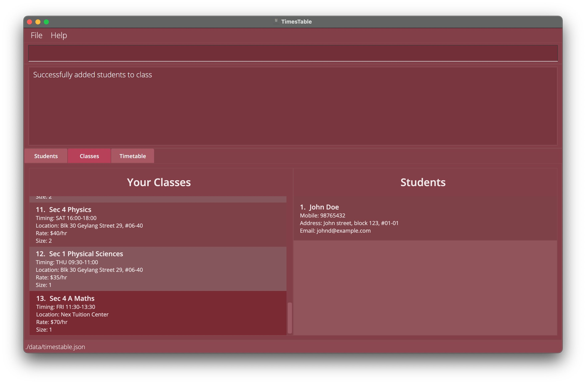
   
6. Continuing on, let me introduce you to the Timetable tab! Here, we are using the [`view`](#viewing-of-different-tabs-view) command.    
Type `view timetable` and press enter.
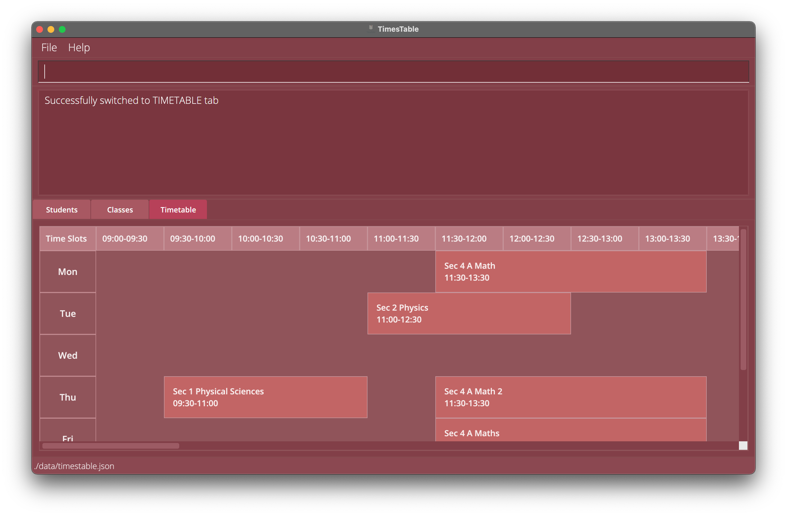  
Here, you can see all the classes that you are teaching in a nice, visual, weekly timetable format! On the first row which is Monday, you can see the 'Sec 4 A Math' class that you just added, with the correct timing.  
  

7. Now that you have experienced the core functionality, you are all ready to explore the other commands.   
To delete, we have commands like [`delete`](#deleting-a-student--delete) and [`deleteclass`](#delete-a-class-deleteclass) for students and classes respectively, and even commands to [`find`](#locating-students-by-name-findname) and [`sort`](#sorting-students-and-classes-sort) classes and students when you have become more familiar with the app, just refer to the [Features](#features) below for details of each command.
Lastly, if you would like to fill in Timestable with your own students, simply use the  [`clear`](#clearing-all-entries--clear) command to delete all the sample students and classes.

## Reading this User Guide
### General Symbols and Syntax

Syntax | Definition
--------|------------------
`UPPER_CASE` | Words in `UPPER_CASE` are the inputs to be supplied by the user.   e.g. in `add n/NAME`, `NAME` is an input which can be used as `add n/John Doe`.
`a/` | Signifies a field. The user inputs the field after the signifier. Also known as a parameter. (see [Glossary](#glossary))
`[a/UPPER_CASE]` | Items in square brackets refer to optional fields.   e.g. `n/NAME [t/TAG]` can be used as `n/John Doe t/friend` or just `n/John Doe`.
`...` | Indicates that the preceding field can be used multiple times.   e.g. `[t/TAG]…​` can be used multiple times, such as`t/friend` or `t/friend t/family`.

### Glossary

Term | Definition
--------|------------------
NOK | Next-of-kin. Refers to the student's guardian, parent or perhaps close friend to be contacted regarding admin matters like payment.
PARAMETERS | The inputs before the `/` are known as _parameters_.  e.g `n/NAME` (`n/` is the parameter for name).  e.g `a/ADDRESS` (`a/` is the parameter for name).
INDEX | The number next to the Student/Class that shows its postion on the list.

## Features

:bulb: **Tip:** Parameters can be in any order. 
  e.g. if the command specifies `n/NAME p/PHONE_NUMBER`, `p/PHONE_NUMBER n/NAME` is also acceptable.

### Student commands

#### Adding a student: `add`

Adds a student to the TimesTable.

Format:
`add n/NAME p/PHONE_NUMBER e/EMAIL a/ADDRESS [t/TAG]… nok/ n/NOK_NAME p/NOK_PHONE_NUMBER e/NOK_EMAIL a/NOK_ADDRESS`

* This is a command that requires next-of-kin (NOK) information.
* This command is split into two segments (excluding command keyword). The first segment are the inputs before
  `nok/` and the second segment are the inputs after `nok/`.
    * Inputs in the first segment are about student information whereas inputs in the second segment are about NOK's information.
* The order of input within its own segment is swappable, but the segments themselves are not.
* The command does not allow adding duplicate students - as defined as the student having the same name, ignoring case.
* `NAME` can have a maximum of 120 characters.
* `PHONE_NUMBER` has to be between 3-25 numbers.
* `TAG` can have a maximum of 15 characters per tag.

:bulb: **Tip:**
A student can have 0 to 5 tags.

Examples:

1. `add n/John Doe p/98765432 e/johnd@example.com a/John street, block 123, #01-01 t/ALevels nok/ n/Mary Doe p/93334848 e/mary23@gmail.com a/311, Clementi Ave 2, #02-25`  
Adds a student with `NAME` `John Doe`, `PHONE` `98765432`, `EMAIL` `johnd@example.com`, `ADDRESS` `John street, block 123, #01-01`,  `TAG` `ALevels`, with next-of-kin with `NAME` `Mary Doe`, `PHONE` `93334848`, `EMAIL` `mary23@gmail.com`, `ADDRESS` `311, Clementi Ave 2, #02-25`

2. `add n/Betsy Crowe t/friend e/betsycrowe@example.com a/Newgate Prison p/1234567 t/slow learner nok/ n/Karen e/karenSUper@gmail.com p/99994444 a/311, Clementi Ave 2, #02-25`  
 Adds a student with `NAME` `Betsy Crowe `, `PHONE` `1234567 `, `EMAIL` `betsycrowe@example.com`, `ADDRESS` `Newgate Prison `,  `TAG` `friend`, with next-of-kin with `NAME` `Karen`, `PHONE` `99994444 `, `EMAIL` `karenSUper@gmail.com `, `ADDRESS` `311, Clementi Ave 2, #02-25`

 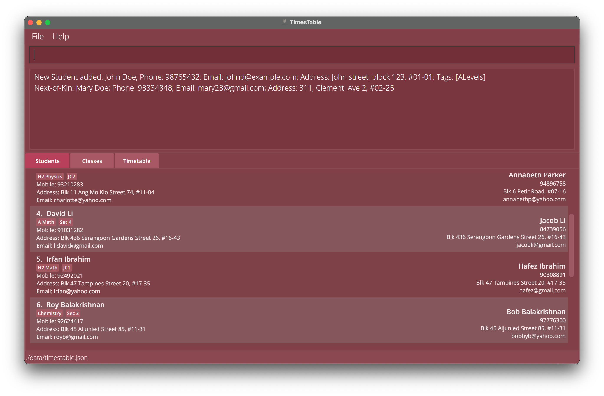

<b>Example 1:</b> Add John Doe 

#### Editing a student : `edit`

Edits an existing student in the TimesTable.

Format:
`edit INDEX [n/NAME] [p/PHONE] [e/EMAIL] [a/ADDRESS] [t/TAG]…​ [nok/ [n/NOK_NAME] [p/NOK_PHONE] [e/NOK_EMAIL] [a/NOK_ADDRESS]]`
`

* Edits the student at the specified `INDEX`. The index refers to the index number shown in the displayed student
  list. The index **must be a positive integer** 1, 2, 3, …​
* At least one of the optional fields must be provided.
* An optional `nok/` (next-of-kin) field can be provided to edit the student's next-of-kin (NOK). All fields that come after `nok/`
  will be for the student's next-of-kin. (same rule from `add` command applies)
    * If `nok/` is provided, at least one of the optional fields belonging to NOK must be provided.
    * Inputs in the first segment are about student information whereas inputs in the second segment are about NOK's information.
* The order of input within its own segment is swappable, but the segments themselves are not.
* When editing tags, the existing tags of the student will be removed i.e adding of tags is not cumulative.
    * You can remove all the student's tags by typing `t/` without
      specifying any tags after it.
* `NAME` can have a maximum of 120 characters.
* `PHONE_NUMBER` has to be between 3-25 numbers.
* `TAG` can have a maximum of 15 characters per tag, with a maximum of 5 tags.

Examples (editing student information only):
1. `edit 1 p/91234567 e/johndoe@example.com` Edits the `PHONE` and `EMAIL` of the 1st student to be `91234567` and `johndoe@example.com` respectively.
2. `edit 2 n/Betsy Crower t/` Edits the `NAME` of the 2nd student to be `Betsy Crower` and clears all existing `TAG`s.
3. `edit 1 n/kevin p/12345678` Edits the `NAME` and `PHONE` of student 1 to become `kevin` and `12345678`.
4. `edit 4 n/John Walker a/4 Petir Road #16-04 Singapore 657891` Edits the `NAME` and `ADDRESS` of the 4th person to be
  `John Walker` and `4 Petir Road #16-04 Singapore 657891` respectively.

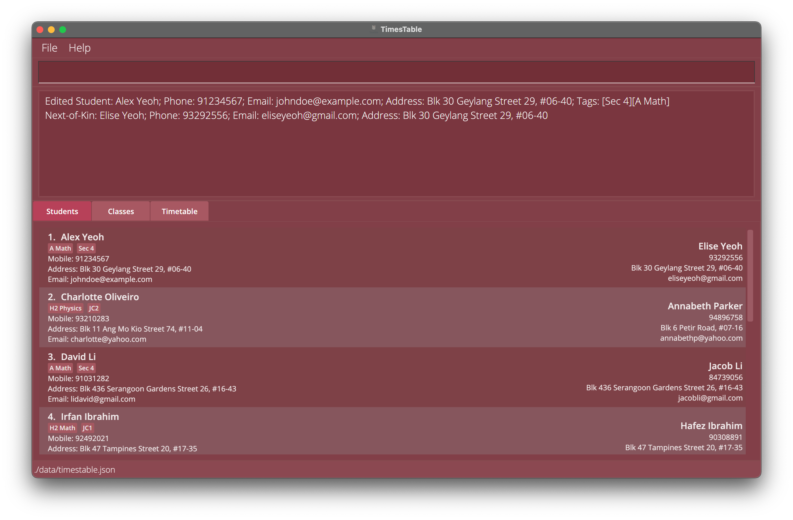

<b>Example 1:</b> Edit Student 1 

Examples (also editing nok information):
1. `edit 2 nok/ p/98429239` Edits 2nd student's NOK's `PHONE` to be `98429239`.
2. `edit 3 a/Com2 nok/ p/98429239` Edits 3rd student's `ADDRESS` to be `Com2` while also editing
  NOK's `PHONE` to be `98429239`.

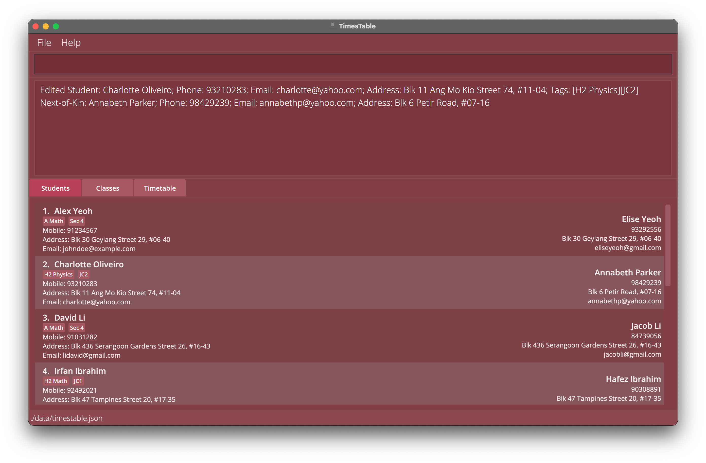

<b>Example 1:</b> Edit Student 2 with next-of-kin information

#### Locating students by name: `findname`

Finds students whose `NAME` contain any of the given keywords.  
Note that if you want to display the entire list of students again, run `list`.

Format:
`findname NAME [, [NAME]...]`

* The search is case-insensitive. e.g. `hans` will match `Hans`.
* The search terms are split by commas. e.g. `findname alex lim, bernice yu`
* Only the student's `NAME` is searched.
* Partial matches will still be matched e.g. `Han` will match `Hans`.
* Persons matching at least one search term will be returned (i.e. `OR` search).
  e.g. `findname alex lim, bernice yu` will return `Alex Lim`, `Bernice Yu`.
* The entire search term is used for matching e.g. `findname Alex L` will match `Alex Lim`
  but not `Alex Yu`
  

Examples:
1. `findname John` returns `john` and `John Doe` in both `Students` and `Classes` tab.
2. `findname alex, david` returns `Alex Yeoh`, `David Li` in both `Students` and `Classes` tab. 

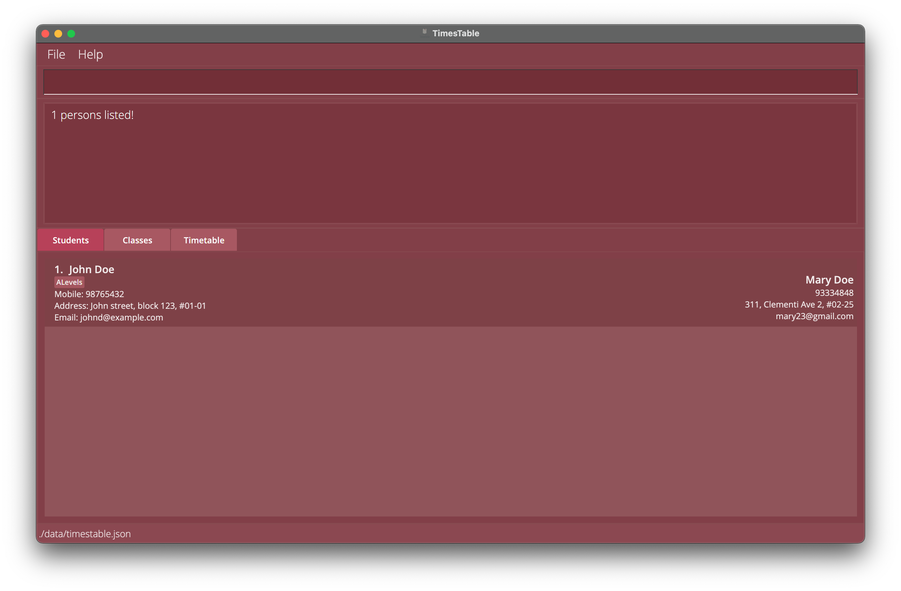

<b>Example 1:</b> Find Students with name John

**:information_source: Note:** 

* For commands that alters the list of students (eg. `findname`, `findtag`, `sort name asc`), the displayed
  changes for students will be shown in both the `Students` tab as well as the `Classes` tab.  
  This means that when students are filtered by their `name` and `tag`, they will be filtered by their `name` and `tag` in the `Classes` tab as well.  
  Likewise, when students are sorted by their names, they will be sorted in the `Classes` tab as well.  
  
* The `list` and `listclass` commands can be used to show the original lists of students and classes respectively.  
  
* Class size will **not** be affected by filtering students (using FindName or FindTag).

#### Locating students by tag: `findtag`

Finds students whose `TAG`s contain any of the given keywords.  
Note that if you want to display the entire list of students again, run `list`.

Format:
`findtag KEYWORD [, [KEYWORD]...]`

* Search terms can partially match the tag, or the entire tag, e.g. `math` for all `A Math` and `C Math` tags, or `A Math` for the `A Math` tag.
* Search terms are separated by commas. e.g. `findtag math, physics` will find students
  with tags containing `math` or `physics`.
* Students matching at least one search term will be returned (i.e. `OR` search).
  e.g. `findtag math, physics` will return students with the `Math` `TAG` but no `Physics` `TAG`,
  students with only the`Physics` `TAG` but no `Math` `TAG`, and students with both `TAG`s.
* The search is case-insensitive. e.g `math` will match `Math`.

Examples:
1. `findtag math` returns `Alex Yeoh` with the `A Math` `TAG` and `John Doe` with the `C Math` `TAG` in both `Students` and `Classes` tab.
2. `findtag math, physics` returns `Alex Yeoh` with the `A Math` and `Biology` `TAG`s in both `Students` and `Classes` tab.
   

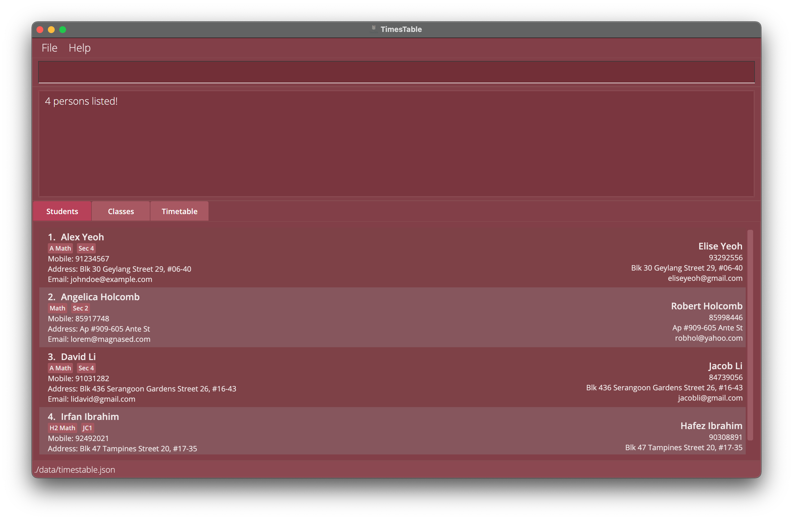

<b>Example 1:</b> Find Students with tag math

**:information_source: Note:** 

* For commands that alters the list of students (eg. `findname`, `findtag`, `sort name asc`), the displayed
  changes for students will be shown in both the `Students` tab as well as the `Classes` tab.  
  This means that when students are filtered by their `name` and `tag`, they will be filtered by their `name` and `tag` in the `Classes` tab as well.  
  Likewise, when students are sorted by their names, they will be sorted in the `Classes` tab as well.

* The `list` and `listclass` commands can be used to show the original lists of students and classes respectively.

* Class size will **not** be affected by filtering students (using FindName or FindTag).

#### Listing all students : `list`

Shows a list of all students in the Students tab.

Format: `list`

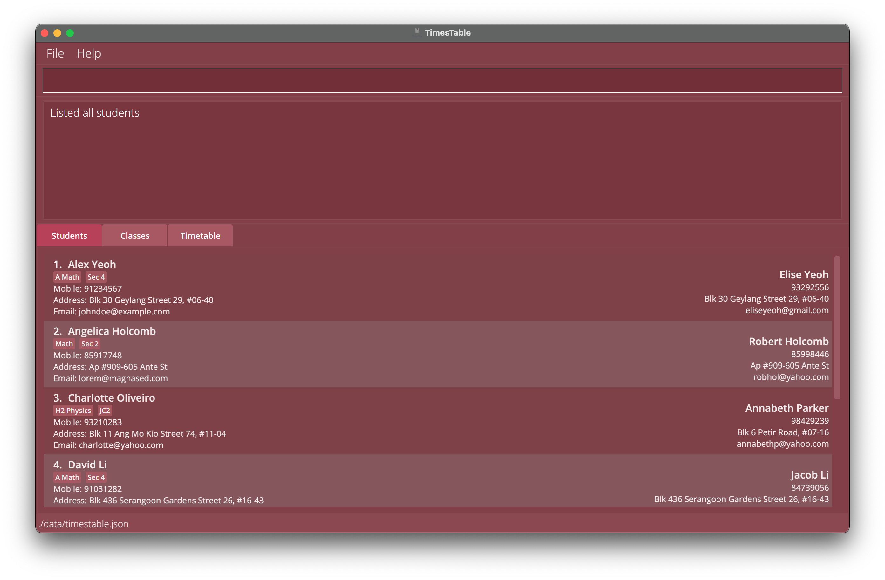

#### Deleting a student : `delete`

Deletes the specified student from the TimesTable.

Format:
`delete INDEX`
* Deletes the student at the specified `INDEX`.
* The index refers to the index number shown in the displayed student list in the `Students` tab.

Examples:
1. `list` followed by `delete 2` deletes the 2nd student in the TimesTable.
2. `findname Betsy` followed by `delete 1` deletes the 1st student in the results of the `find` command.

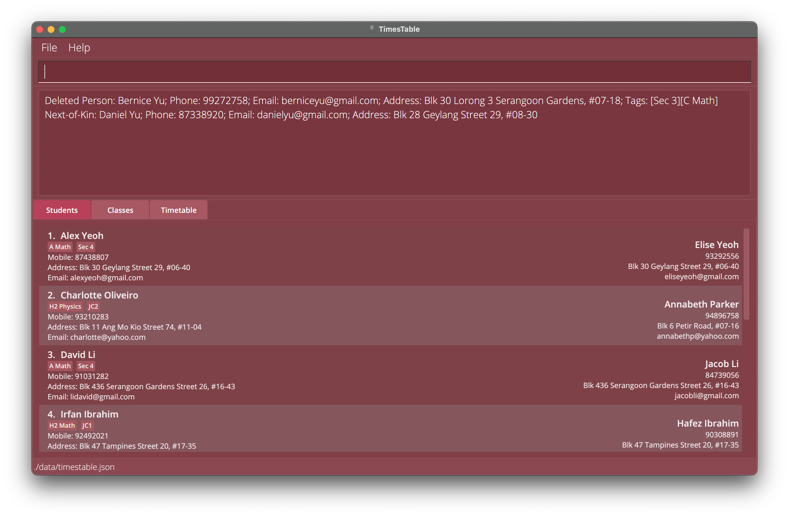

<b>Example 1:</b> Deletes the 2nd student 

### Class commands

#### Adding a class: `addclass`

Add a class to the TimesTable.

Format:
`addclass cn/CLASS_NAME ct/CLASS_TIMING r/HOURLY_RATE l/LOCATION`

* This command adds a new class to keep track of all classes that the user is teaching.
* `CLASS_TIMING` must be in the form `ct/DAY HH:MM-HH:MM`
* `DAY` is case insensitive.
* `CLASS_TIMING` can only start and end at the hour mark or half hour mark, but can also end at 23:59 hours.
* `RATE` must be less than $1,000,000/hr

Examples:
1. `addclass cn/CS2103T ct/MON 09:30-11:30 r/70 l/Nex Tuition Center`
Adds a new class with name `CS2103T`, with class timing `MON 09:30-11:30`, with hourly rate of $`70`, at `Nex
Tuition Center`.

2. `addclass cn/Sec 4 E Maths ct/TUE 12:30-14:30 r/65 l/Block 123, Clementi Ave 6, #14-41`
Adds a new class with name `Sec 4 E Maths`, with class timing `Tue 12:30-14:30`, with hourly rate of $`65`, at `Block 123, Clementi Ave 6, #14-41`.

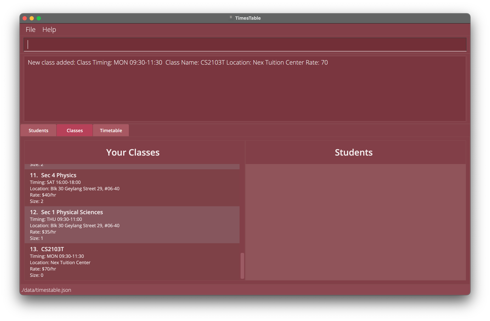

<b>Example 1:</b> Adding CS2103T class

#### Editing a class: `editclass`

Edits an existing class in the class list in the `classes` tab.

Format:
`editclass 1 [cn/CLASS_NAME] [ct/CLASS_TIMING] [r/RATE] [l/LOCATION]`

* Edits the class at the specified `INDEX`. The index refers to the index number shown in the displayed class
  list in the `classes` tab.
    * The index **must be a positive integer** 1, 2, 3, …​
    * The index must belong to a class.
* At least one of the optional fields must be provided.
* `CLASS_TIMING` can only start and end at the hour mark or half hour mark, but can also end at 23:59 hours.
* Edit commands that will create a clash of `CLASS_TIMING` with other classes is not accepted.
* `RATE` must be less than $1,000,000/hr

Examples:
1. `editclass 1 ct/wed 15:00-17:00` Edits the first class in the class list's `CLASS_TIMIMG` to be on Wednesday from
3pm to 5pm.

<b>Example 1:</b> Editing class indexed 1

#### Adding student/students to a class: `addtoclass`

Add a single or multiple students to an existing class.

Format:
`addtoclass CLASS_INDEX STUDENT_INDEX...`

* This command adds any number of existing students into an existing class.
* `CLASS_INDEX` is the index number of the class in the displayed class list in the `Classes` tab, which will be
  receiving the new students.
* `STUDENT_INDEX...` are the index number/s of the students shown in the displayed student list in the `Students` tab, these students are
  to be added into the class.
* Exactly one class index must be provided and at least one student index must be provided.
* Students that already exist in the class can't be added to the same class.
* If you enter duplicate student indices in one command, Timestable will only add the student once.
* Size of the class will change to reflect the number of students in the class.

Example:
1. `addtoclass 13 1 2 3`
Adds the 1st, 2nd and 3rd student in the displayed student list in the `Students` tab into the 13th class in the
displayed class list in the `Classes` tab, `size` of the class will increase by 3.

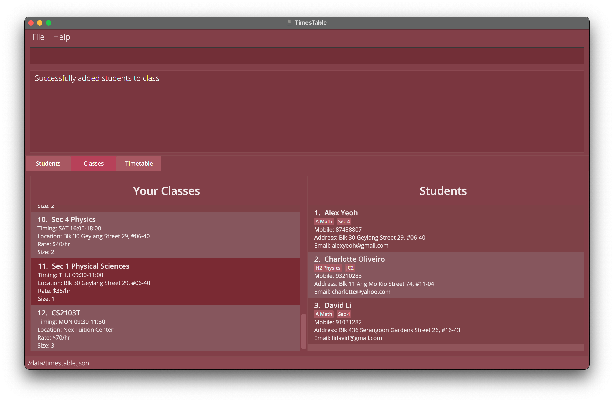

<b>Example 1:</b> Adding students indexed 1, 2 and 3 to class indexed 13

#### Removing students from a class: `removefromclass`

Removes a single or multiple students from an existing class.

Format:
`removefromclass CLASS_INDEX STUDENT_INDEX...`

* Removes a non-zero number of existing students from an existing class.
* `CLASS_INDEX` is the index number of the class in the displayed class list in the `Classes` tab to have its students removed from.
* `STUDENT_INDEX...` are the index number(s) of the students, shown in the displayed student list of the class to be removed from
  in the `Classes` tab.

Example:
1. `removefromclass 13 1 2 3`
Removes the 1st, 2nd and 3rd student in the displayed student list of the 13th class in the `classes` tab, causing the
`size` of 1st class to decrease by 3.

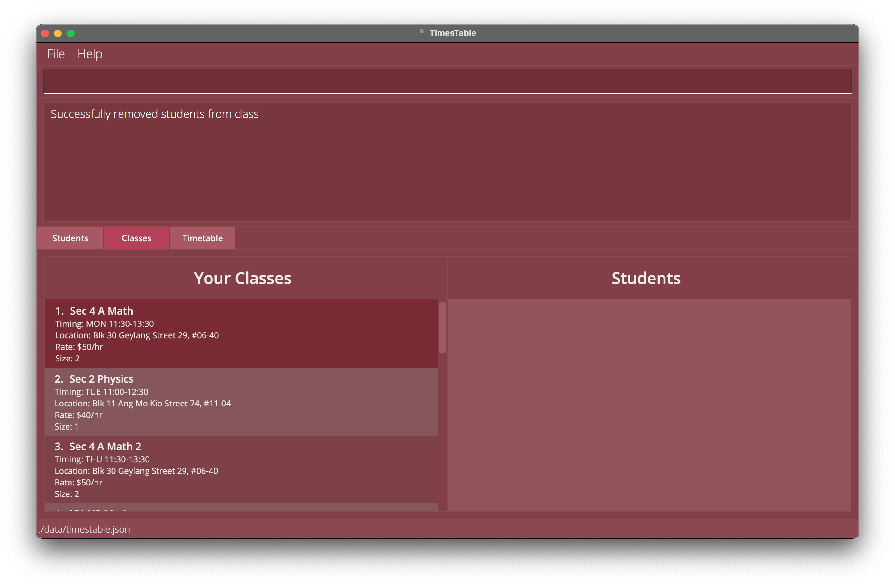

<b>Example 1:</b> Remove students indexed 1, 2 and 3 in class list from class indexed 13

#### Locating class by class timing : `findclass`

Finds a class whose `CLASS_TIMING` matches the given keyword.  
Note that if you want to display the list of classes again, run `listclass`.

Format: `findclass CLASS_TIMING`

* The valid keywords for `CLASS_TIMING` are limited to the following types:
    1. 3 letter abbreviation for day of the week e.g. `Mon`, `Tue`, etc.
    2. Time expressed in HH:MM-HH:MM format   e.g. `11:30-12:30`, `15:00-16:00`, etc.
        * `CLASS_TIMING` can only start and end at the hour mark or half hour mark, but can also end at 23:59 hours.
* Either a single keyword or two keywords of different types should be provided otherwise no classes would be returned.
* Multiple keywords of the same type (eg Mon Tue) would not return any classes, because the command finds classes which contain both timings (Mon and Tue), and
  it is currently not possible to have a class with two different timings (ie a class that occurs on both Monday and Tuesday or both `10:00-12:00` and `17:00-19:00`)
    * Important clarification: In TimesTable, class refers to a single slot per week in the timetable.
* If two keywords are entered, then the class returned would be the one that match all the keywords
  (see example below).

Examples:
1. Single keyword  
    1.1. `findclass mon` returns all classes on Monday.  
    1.2. `findclass 10:00-12:00` returns all classes scheduled for `10:00 to 12:00` no matter which day of the week it belongs
      to.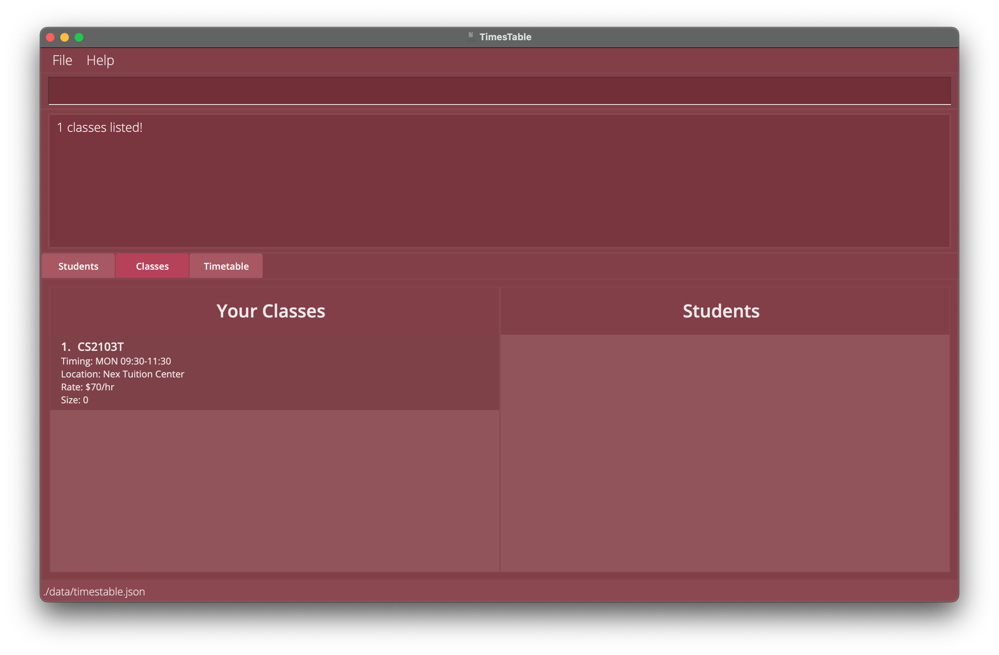 
      
<b>Example 1.1:</b> Find all classes on Monday
    
2. Two keywords  
    2.1 `findclass mon 11:30-13:30` returns the exact class on `Mon at 11:30-13:30`.  
    2.2 `findclass tue 11:00-12:00` returns the exact class on `Tue at 11:00-12:00`. 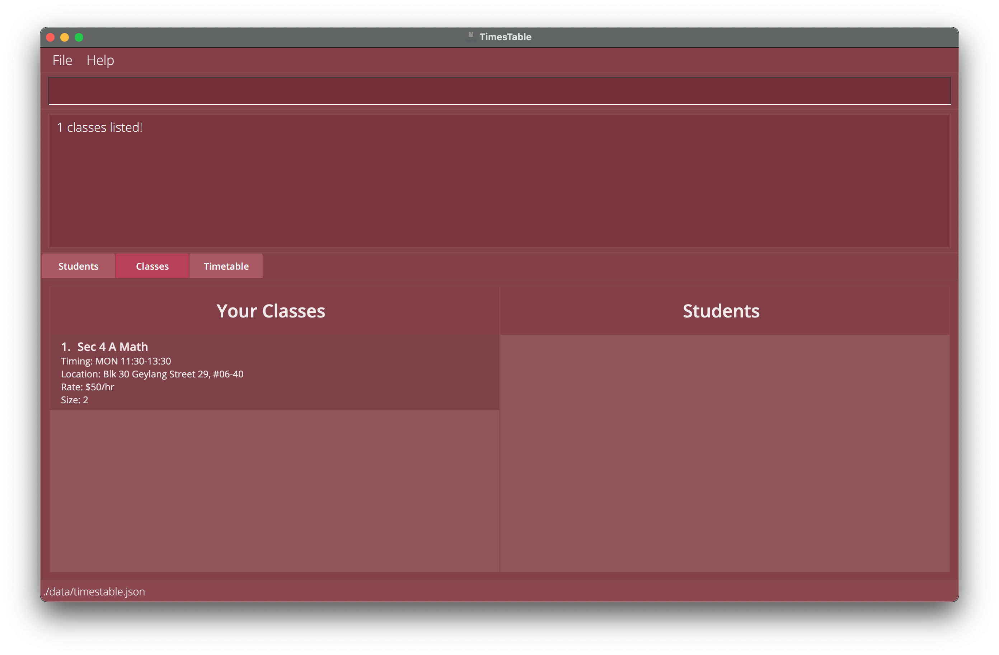 
      
<b>Example 2.1:</b> Find classes on Monday at 11:30-13:30
    
3. Negative examples (Two or more keywords of the same type)  
    3.1 `findclass mon tue` returns nothing.  
    3.2 `findclass 09:00-10:30 11:00-12:00` returns nothing.
   
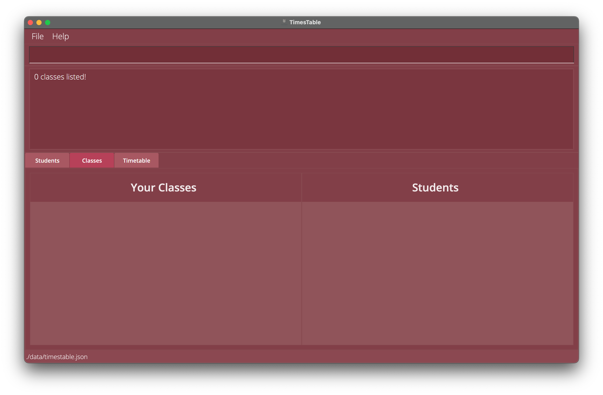  

<b>Example 3.1:</b> Find classes with two keywords of the same type

  

#### Locating class by class name: `findclassname`

Finds a class whose class name matches the given keywords.  
Note that if you want to display the list of classes again, run `listclass`.

Format:
`findclassname CLASS_NAME [, [CLASS_NAME]...]`

* The search is case-insensitive `PHYSICS` will match 'physics'.
* The search terms are split by commas. e.g. `findclassname sec 4 physics, jc math`
* Only the class' `CLASS_NAME` is searched.
* Partial matches will still be matched e.g. `Phy` will match `Physics`.
* Classes matching at least one search term will be returned (i.e. `OR` search).
  e.g. `findclassname sec 4 phy, jc math` will return `sec 4 physics`, `jc mathematics`.
* The entire search term is used for matching e.g. `findclassname sec 4 phy` will match `sec 4 physics`
  but not `sec 4 maths`

Examples:
1. `findclassname math` returns all the classes with math in the class name.
2. `findclassname Sec, 4, maths` returns all the classes with `sec` or `4` or `maths` in the class name. Hence,
  class with name `sec 4 physics` and class with name `JC maths` would both be returned.
  
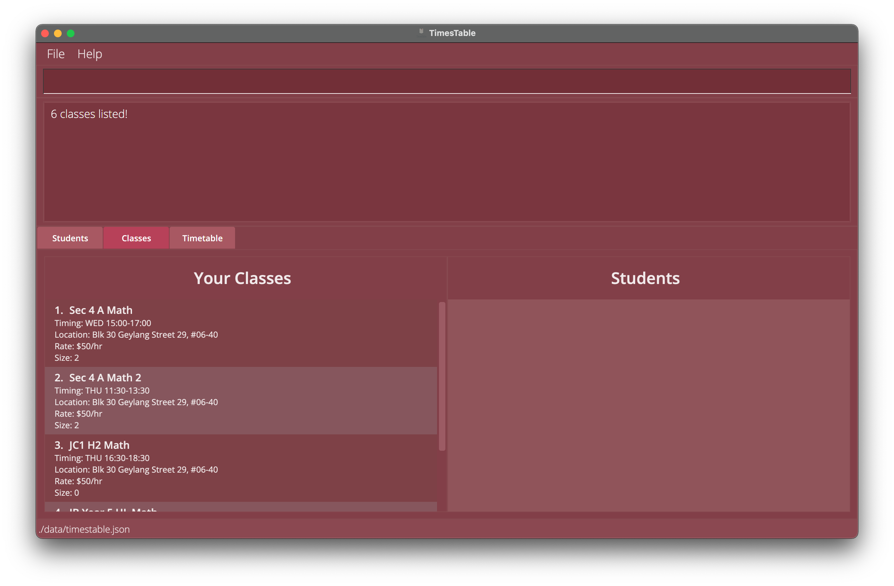

<b>Example 1:</b> Find classes with math in the class name

#### Listing all the classes: `listclass`

Shows a list of all classes in the Classes tab.

Format: `listclass`

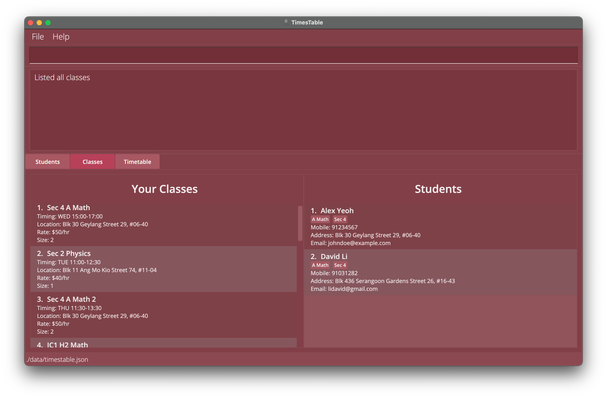

#### Selecting of classes: `class`

Selects a class in the Classes tab and displays its students without the need to use the mouse to double click the respective class.

Format:
`class CLASS_INDEX`

* Selected class will not be highlighted in the same way as when you click on a class using the mouse.
* `CLASS_INDEX` must be an index of a class that exists in the displayed class list.

Examples:
* `class 1` selects the class with `CLASS_INDEX` of `1` and displays its students in the Classes tab.

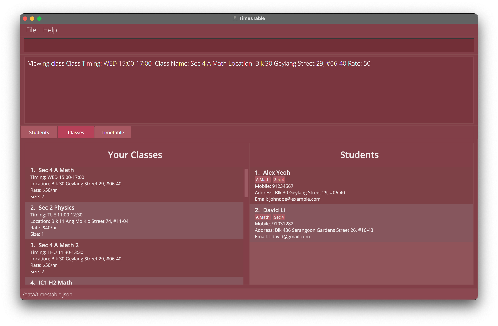

#### Delete a class: `deleteclass`

Deletes the specified class from the TimesTable.

Format:
`deleteclass INDEX`

* Deletes the class at the specified `INDEX`.
* The index refers to the index number shown in the displayed class list in the `Classes` tab.

Examples:
* `listclass` followed by `deleteclass 2` deletes the 2nd class in the TimesTable.

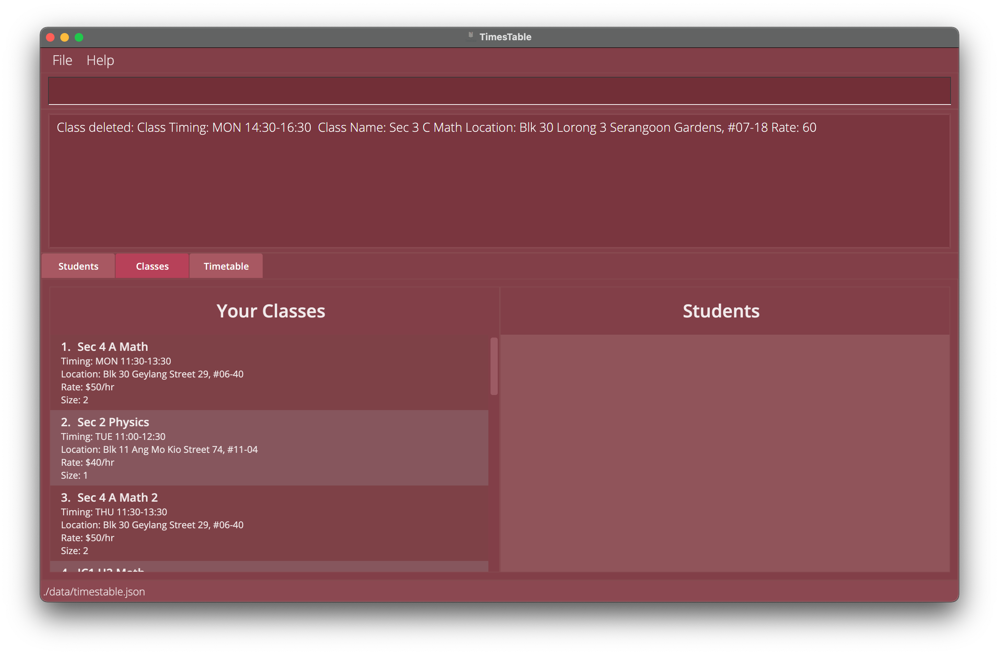

### General commands

#### Sorting students and classes: `sort`

Sorts the students based on their `NAME` in alphabetical order, 
or classes based on their `CLASS_TIMING`, in either ascending or descending order.

Format:
`sort PARAMETER_TO_SORT_BY DIRECTION_OF_SORT`

* `PARAMETER_TO_SORT_BY` can either be `name` or `timing` which sorts the students and classes respectively.
* `DIRECTION_OF_SORT` can either be `asc` or `desc` to represent ascending and descending respectively.
* Sorting by `name` sorts the students in the Students tab and Classes tab but sorting by `timing` only sorts the classes in Classes tab but not the students in Students tab.

Examples:
1. `sort name asc` sorts students alphabetically by their `NAME` in ascending order.
2. `sort name desc` sorts students alphabetically by their `NAME` in descending order.
3. `sort timing asc` sorts classes based on their `CLASS_TIMING` starting from the earliest in the week to the latest.
4. `sort timing desc` sorts classes based on their `CLASS_TIMING` starting from the latest in the week to the earliest.

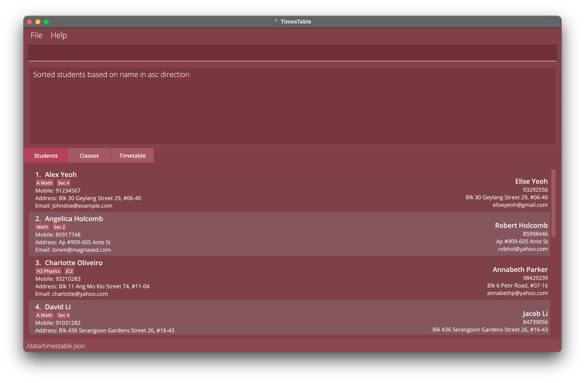

<b>Example 1:</b> Sorts students in alphabetical order

**:information_source: Note:** 

* For commands that alters the list of students (eg. `findname`, `findtag`, `sort name asc`), the displayed
  changes for students will be shown in both the `Students` tab as well as the `Classes` tab.  
  This means that when students are filtered by their `name` and `tag`, they will be filtered by their `name` and `tag` in the `Classes` tab as well.  
  Likewise, when students are sorted by their names, they will be sorted in the `Classes` tab as well.

* The `list` and `listclass` commands can be used to show the original lists of students and classes respectively.

* Class size will **not** be affected by filtering students (using FindName or FindTag).

#### Viewing of different tabs: `view`

Views an existing tab in the TimesTable without the need to use the mouse to click.

Format:
`view TAB_TO_VIEW`

* `TAB_TO_VIEW` has to be an existing tab in Timestable (`students`, `classes`, `timetable`).

Examples:
1. `view timetable` switches the displayed tab to be the `timetable` tab.

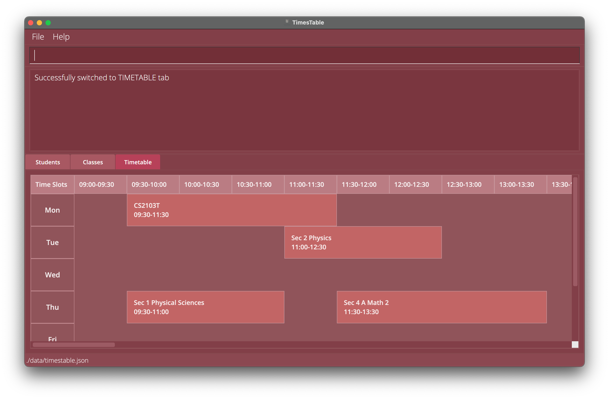

#### Clearing all entries : `clear`

Clears all entries from the TimesTable.

Format: `clear`

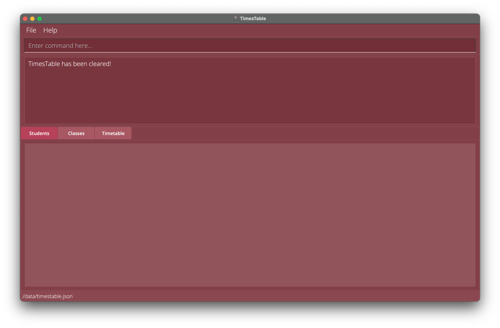

#### Viewing help : `help`

Shows a message explaining how to access the help page.

Format: `help`

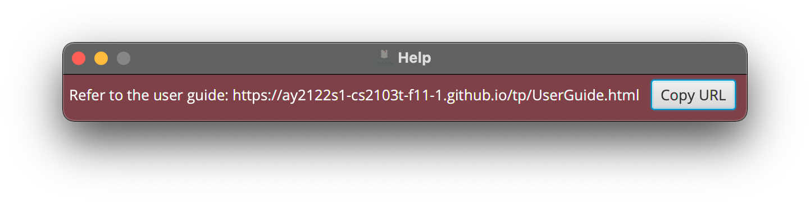

#### Exiting the program : `exit`

Exits the program.

Format: `exit`

#### Saving the data

TimesTable data is saved in the hard disk automatically in the `data` folder present in the same directory as `timestable.jar` after any command that changes the data. There is no need to save manually.

#### Editing the data file

TimesTable data are saved as a JSON file `[JAR file location]/data/timestable.json`. Advanced users are welcome to update data directly by editing that data file.

:exclamation: **Caution:**
If your changes to the data file makes its format invalid, Timestable will discard all data and start with an empty data file at the next run.

--------------------------------------------------------------------------------------------------------------------

## FAQ

**Q**: How do I transfer my data to another Computer? 
**A**: Install the app in the other computer and overwrite the empty data file it creates with the file that contains the data of your previous Timestable home folder.

**Q**: Are you going to add XXX feature? What features are you planning to add? 
**A**: I'm glad you asked! We're currently planning to add the following features:

### Upcoming Features:

#### Payment Management with Invoice

Different classes you teach will have different hourly rates, and they will of course have varying lengths and frequencies. 
Having to keep track of how much someone has to pay and whether they have paid is a major source of stress.

We recognise this demand, and thus are working on this feature for you to easily track required payments to students.

A work in progress sneak peak of the feature is shown below.  

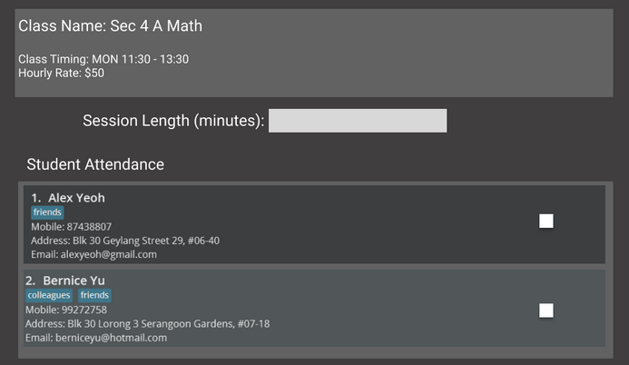  

After a class, just input the time taught for that class and mark the attendance of those present.
  
For each student present, TimesTable will take the hourly rate multiplied by the 
session length for each person present to calculate the amount that each student has to pay.  

The session length field is useful when the class length goes beyond the intended length or when the class cuts short.  

This information will then be consolidated in an invoice to be generated.

When you want to generate a new invoice, simply use the 'createinvoice' command. Invoices will be generated for all 
students of the selected class. These invoices will use the session attendances recorded since the last invoice, generating
a table with the relevant information such as session date, session length, hourly rate, student name, and so on. You will
also be able to set the due date for the invoice. 

An example of the invoice generated is shown below.

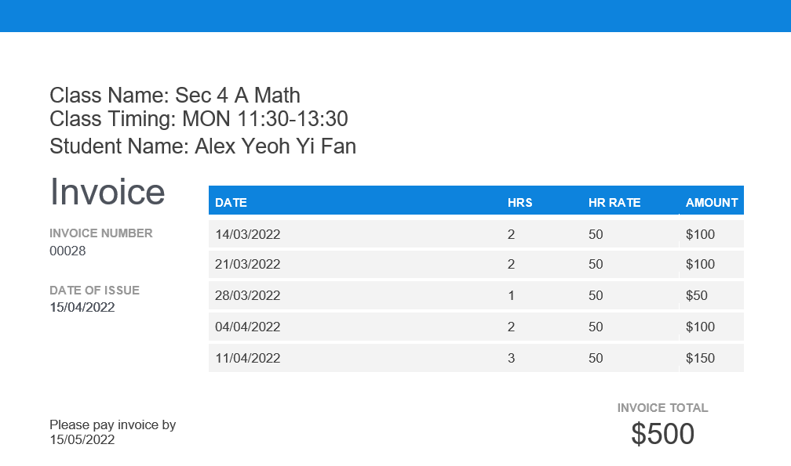

With this invoice generation feature, you will easily be able to charge the correct amount to your clients
and you would also not have to worry about providing evidence. TimesTable will take care of it for you.

In addition to invoice generation, we are also working on an invoice management feature that will allow you to track
the status of each invoice. You will be able to mark the invoices as paid, and archive them. TimesTable will also
alert you once the due date for any invoice has passed. You can simply let TimesTable keep track of all payments for you.

If there are any other proposed features, please submit an issue via our GitHub over [here](https://github.com/AY2122S1-CS2103T-F11-1/tp/issues) and we'll look into it!

--------------------------------------------------------------------------------------------------------------------

## Command summary

### Student Commands Summary

Action | Format, Examples|
--------|------------------|
**Add** | `add n/NAME p/PHONE_NUMBER e/EMAIL a/ADDRESS [t/TAG]… nok/ n/NOK_NAME p/NOK_PHONE_NUMBER e/NOK_EMAIL a/NOK_ADDRESS`   e.g., `add n/John Doe p/98765432 e/johnd@example.com a/John street, block 123, #01-01 t/ALevels nok/ n/Mary Doe p/93334848 e/mary23@gmail.com a/311, Clementi Ave 2, #02-25 `|
**Delete** | `delete INDEX`  e.g., `delete 3`|
**Edit** | `edit INDEX [n/NAME] [p/PHONE] [e/EMAIL] [a/ADDRESS] [t/TAG]…​ [nok/ [n/NOK_NAME] [p/NOK_PHONE] [e/NOK_EMAIL] [a/NOK_ADDRESS]]`  e.g.,`edit 2 n/James Lee e/jameslee@example.com`|
**Find name** | `findname NAME [, [NAME]...]`   e.g., `find Stuart`|
**Find tag** | `findtag KEYWORD [, [KEYWORD]...]`   e.g., `findtag  math, physics`|
**List** | `list`|
**Sort** | `sort PARAMETER_TO_SORT_BY DIRECTION_OF_SORT`   e.g., `sort name asc`|

### Class Commands Summary

Action | Format, Examples|
--------|------------------|
**Add class** | `addclass cn/CLASS_NAME ct/CLASS_TIMING r/HOURLY_RATE l/LOCATION`   e.g., `addclass cn/Sec 4 A Maths ct/mon 11:30-13:30 r/70 l/Nex Tuition Center`|
**Add to class** | `addtoclass CLASS_INDEX STUDENT_INDEX…`   e.g., `addtoclass 1 1 2 3`|
**Delete class** | `deleteclass INDEX`   e.g., `deleteclass 2`|
**Edit class** | `editclass 1 [cn/CLASS_NAME] [ct/CLASS_TIMING] [r/RATE] [l/LOCATION]`   e.g., `editclass 1 ct/wed 15:00-17:00`|
**Find class name** | `findclassname CLASS_NAME [, [CLASS_NAME]...]`   e.g., `findclassname math`|
**Find class timing** | `findclass CLASS_TIMING`   e.g., `findclass mon 11:00-12:00`|
**List class** | `listclass`|
**Remove from class** | `removefromclass CLASS_INDEX STUDENT_INDEX...`   e.g., `removefromclass 1 1 2 3`|
**Select class** | `class CLASS_INDEX`   e.g., `class 2`|
**Sort** | `sort PARAMETER_TO_SORT_BY DIRECTION_OF_SORT`   e.g., `sort timing asc`|

### General Commands Summary

Action | Format, Examples|
--------|------------------|
**Clear** | `clear`|
**Exit** | `exit`|
**Help** | `help`|
**View** | `view TAB_TO_VIEW`   e.g., `view timetable`|

