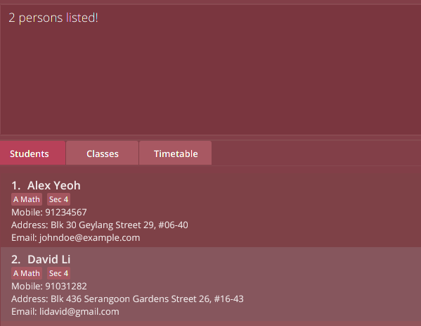

TimesTable is a **desktop app for managing your tuition students and classes, optimized for use via a Command Line Interface** (CLI) while still having the benefits of a Graphical User Interface (GUI). If you can type fast, TimesTable can get your class management tasks done faster than traditional GUI apps.

* Table of Contents
{:toc}

--------------------------------------------------------------------------------------------------------------------

## Quick start

1. Ensure you have Java `11` or above installed in your Computer, if you do not, you can download it from [here](https://www.oracle.com/java/technologies/downloads/#jdk17-linux).

1. Download the latest `timestable.jar` from [here](https://github.com/AY2122S1-CS2103T-F11-1/tp/releases).

1. Copy the file to the folder you want to use as the _home folder_ for your TimesTable.

1. Double-click the file to start the app. The GUI similar to the below should appear in a few seconds. Note how the app contains some sample student data.<br>
   

1. Type the command in the command box and press 'Enter' to execute it. e.g. typing **`help`** and pressing 'Enter' will open the help window.<br>
   Here are some example commands which you can use on our sample students data before using your own students data:

   * **`add `**`n/John Doe p/98765432 e/johnd@example.com a/John street, block 123, #01-01 nok/ n/Jack Doe p/10987654 e/jackd@example.com a/311, Clementi Ave 2, #02-25` : Adds a contact named `John Doe` to the TimesTable.

   * **`delete `**`3` : Deletes the 3rd contact shown in the current list.
   
   * **`sort `**`name asc` : Sorts the students by their name in ascending alphabetic order.
    
   * **`addclass `**`cn/Sec 4 A Maths ct/FRI 11:30-13:30 r/70 l/Nex Tuition Center`: Adds a new class with name 'Sec 4 A Maths', with class timing MON 11.30-13:30, with hourly rate of $70, at Nex Tuition Center.
    
   * **`addtoclass `**`1 2 3`: Adds the 2nd and 3rd student in the student list in the `students` tab into the 1st class in the `classes` tab

   * **`view `**`classes` : Changes the tab the user is on to the `classes` tab which displays all the classes.
   
   * **`view `**`timetable` : Changes the tab the user is on to the `timetable` tab which displays a timetable with all the classes. 
   
   * **`exit `** : Exits the app.

1. Once you are ready to fill in Timestable with your own students, simply use the  **`clear`** command to delete all the sample students, instead of having to delete them one by one.
   Now you can start putting your students into Timestable.

1. Refer to the [Features](#features) below for details of each command.

--------------------------------------------------------------------------------------------------------------------

## Features

<div markdown="block" class="alert alert-info">

**:information_source: Notes about the command format:**<br>

* Words in `UPPER_CASE` are the inputs to be supplied by the user.<br>
  e.g. in `add n/NAME`, `NAME` is an input which can be used as `add n/John Doe`.

* Items in square brackets are optional.<br>
  e.g `n/NAME [t/TAG]` can be used as `n/John Doe t/friend` or as `n/John Doe`.

* Items with `…`​ after them can be used multiple times including zero times.<br>
  e.g. `[t/TAG]…​` can be used as ` ` (i.e. 0 times), `t/friend`, `t/friend t/family` etc.

* Parameters can be in any order.<br>
  e.g. if the command specifies `n/NAME p/PHONE_NUMBER`, `p/PHONE_NUMBER n/NAME` is also acceptable.

* If a parameter is expected only once in the command but you specified it multiple times, only the last occurrence of the parameter will be taken.<br>
  e.g. if you specify `p/12341234 p/56785678`, only `p/56785678` will be taken.

* Extraneous parameters for commands that do not take in parameters (such as `help`, `list`, `listclass`, `exit` and `clear`) will be ignored.<br>
  e.g. if the command specifies `help 123`, it will be interpreted as `help`.

* For commands that require next-ok-kin (NOK) information, all inputs regarding NOK should be after `nok/` and all
  inputs regarding the student should be before `nok/`. Timestable does not allow order swap!<br>
  e.g. `n/John p/97833242 … /nok n/Harry p/87738383 …` `John` and `97833242` are information belonging to the student
  and `John`'s NOK's name is `Harry` whose phone number is `87738383`.

* For commands that require index (e.g. `editclass`, `addtoclass`, etc), zero, negative and out-of-range indices are 
rejected with an error message. (Out of range means that the index entered is greater than the number of entries in
a class or student list)
  
* For commands that alters the list of students (eg. `findname`, `findtag`, `sort name asc`), the displayed
  changes for students will be shown in both the `Students` tab as well as the `Classes` tab.  
  This means that when students are filtered by their `name` and `tag`, they will be filtered by their `name` and `tag` in the `Classes` tab as well.  
  Likewise, when students are sorted by their names, they will be sorted in the `Classes` tab as well.

* The `list` and `listclass` commands can be used to show the original lists of students and classes respectively.

* Class size will **not** be affected by filtering students (using FindName or FindTag).

* All arguments can have a maximum of 85 characters except otherwise stated.

</div>

### Clearing all entries : `clear`
<hr>

Clears all entries from the TimesTable.

Format: `clear`

### Adding a student: `add`
<hr>

Adds a student to the TimesTable.

Format:
```
add n/NAME p/PHONE_NUMBER e/EMAIL a/ADDRESS [t/TAG]… nok/ n/NOK_NAME p/NOK_PHONE_NUMBER e/NOK_EMAIL a/NOK_ADDRESS
```

* This is a command that requires next-of-kin (NOK) information.
* This command is split into two segments (excluding command keyword). The first segment are the inputs before
  `nok/` and the second segment are the inputs after `nok/`.
    * Inputs in the first segment are about student information whereas inputs in the second segment are about NOK's information.
* The order of input within its own segment is swappable, but the segments themselves are not.
* The command does not allow adding duplicate students - as defined as the student having the same name, ignoring case.
* `NAME` can have a maximum of 120 characters.
* `PHONE_NUMBER` has to be between 3-25 numbers.

<div markdown="span" class="alert alert-primary">:bulb: **Tip:**
A student can have any number of tags (including 0).
</div>

Examples:

```
add n/John Doe p/98765432 e/johnd@example.com a/John street, block 123, #01-01 t/ALevels nok/ n/Mary Doe p/93334848 e/mary23@gmail.com a/311, Clementi Ave 2, #02-25 
```

```
add n/Betsy Crowe t/friend e/betsycrowe@example.com a/Newgate Prison p/1234567 t/slow learner nok/ n/Karen e/karenSUper@gmail.com p/99994444 a/311, Clementi Ave 2, #02-25 
```

### Adding a class: `addclass`
<hr>

Add a class to the TimesTable.

Format:

```
addclass cn/CLASS_NAME ct/CLASS_TIMING r/HOURLY_RATE l/LOCATION
```

* This command adds a new class to keep track of all classes that the user is teaching.
* `CLASS_TIMING` must be in the form `ct/DAY HH:MM-HH:MM`
* `DAY` is case insensitive.
* `CLASS_TIMING` can only start and end at the hour mark or half hour mark, but can also end at 23:59 hours.
* `RATE` must be less than $1,000,000/hr

Examples:
```
addclass cn/CS2103T ct/MON 09:30-11:30 r/70 l/Nex Tuition Center
```
Adds a new class with name `CS2103T`, with class timing `MON 09:30-11:30`, with hourly rate of $`70`, at `Nex
Tuition Center`.

```
addclass cn/Sec 4 E Maths ct/TUE 12:30-14:30 r/65 l/Block 123, Clementi Ave 6, #14-41
```
Adds a new class with name `Sec 4 E Maths`, with class timing `Tue 12:30-14:30`, with hourly rate of $`65`, at `Block 123, Clementi Ave 6, #14-41`.

### Deleting a student : `delete`
<hr>

Deletes the specified student from the TimesTable.

Format:
```
delete INDEX
```
* Deletes the student at the specified `INDEX`.
* The index refers to the index number shown in the displayed student list in the `Students` tab.

Examples:
* `list` followed by `delete 2` deletes the 2nd student in the TimesTable.
* `findname Betsy` followed by `delete 1` deletes the 1st student in the results of the `find` command.

### Delete a class: `deleteclass`
<hr>

Deletes the specified class from the TimesTable.

Format:
```
deleteclass INDEX
```

* Deletes the class at the specified `INDEX`.
* The index refers to the index number shown in the displayed class list in the `Classes` tab.

Examples:
* `listclass` followed by `deleteclass 2` deletes the 2nd class in the TimesTable.

### Adding student/students to a class: `addtoclass`
<hr>

Add a single or multiple students to an existing class.

Format:
```
addtoclass CLASS_INDEX STUDENT_INDEX...
```

* This command adds any number of existing students into an existing class.
* `CLASS_INDEX` is the index number of the class in the displayed class list in the `Classes` tab, which will be
  receiving the new students.
* `STUDENT_INDEX...` are the index number/s of the students shown in the displayed student list in the `Students` tab, these students are
  to be added into the class.
* Exactly one class index must be provided and at least one student index must be provided.
* Students that already exist in the class can't be added to the same class.
* If you enter duplicate student indices in one command, Timestable will only add the student once.
* Size of the class will change to reflect the number of students in the class.

Example:
```
addtoclass 1 1 2 3
```
Adds the 1st, 2nd and 3rd student in the displayed student list in the `Students` tab into the 1st class in the
displayed class list in the `Classes` tab, `size` of the class will increase by 3.

### Removing students from a class: `removefromclass`
<hr>

Removes a single or multiple students from an existing class.

Format:
```
removefromclass CLASS_INDEX STUDENT_INDEX...
```

* Removes a non-zero number of existing students from an existing class.
* `CLASS_INDEX` is the index number of the class in the displayed class list in the `Classes` tab to have its students removed from.
* `STUDENT_INDEX...` are the index number(s) of the students, shown in the displayed student list of the class to be removed from
  in the `Classes` tab.


Example:
```
removefromclass 1 1 2 3
```
Removes the 1st, 2nd and 3rd student in the displayed student list of the 1st class in the `classes` tab, causing the
`size` of 1st class to decrease by 3.


### Editing a student : `edit`
<hr>

Edits an existing student in the TimesTable.

Format:
```
edit INDEX [n/NAME] [p/PHONE] [e/EMAIL] [a/ADDRESS] [t/TAG]…​ [nok/ [n/NOK_NAME] [p/NOK_PHONE] [e/NOK_EMAIL] [a/NOK_ADDRESS]]

```

* Edits the student at the specified `INDEX`. The index refers to the index number shown in the displayed student
  list. The index **must be a positive integer** 1, 2, 3, …​
* At least one of the optional fields must be provided.
* An optional `nok/` (next-of-kin) field can be provided to edit the student's next-of-kin (NOK). All fields that come after `nok/`
  will be for the student's next-of-kin. (same rule from `add` command applies)
    * If `nok/` is provided, at least one of the optional fields belonging to NOK must be provided.
* The order of input within its own segment is swappable, but the segments themselves are not.
* When editing tags, the existing tags of the student will be removed i.e adding of tags is not cumulative.
    * You can remove all the student's tags by typing `t/` without
      specifying any tags after it.
* `NAME` can have a maximum of 120 characters.
* `PHONE_NUMBER` has to be between 3-25 numbers.

Examples (editing student information only):
* `edit 1 p/91234567 e/johndoe@example.com` Edits the `PHONE` and `EMAIL` of the 1st student to be `91234567` and `johndoe@example.com` respectively.
* `edit 2 n/Betsy Crower t/` Edits the `NAME` of the 2nd student to be `Betsy Crower` and clears all existing `TAG`s.
* `edit 1 n/kevin p/12345678` Edits the `NAME` and `PHONE` of student 1 to become `kevin` and `12345678`.
* `edit 4 n/John Walker a/4 Petir Road #16-04 Singapore 657891` Edits the `NAME` and `ADDRESS` of the 4th person to be
  `John Walker` and `4 Petir Road #16-04 Singapore 657891` respectively.

Examples (also editing nok information):
* `edit 2 nok/ p/98429239` Edits 2nd student's NOK's `PHONE` to be `98429239`.
* `edit 3 a/Com2 nok/ p/98429239` Edits 3rd student's `ADDRESS` to be `Com2` while also editing
  NOK's `PHONE` to be `98429239`.

### Editing a class: `editclass`
<hr>

Edits an existing class in the class list in the `classes` tab.

Format:
```
editclass 1 [cn/CLASS_NAME] [ct/CLASS_TIMING] [r/RATE] [l/LOCATION]
```

* Edits the class at the specified `INDEX`. The index refers to the index number shown in the displayed class
  list in the `classes` tab. 
  * The index **must be a positive integer** 1, 2, 3, …​
  * The index must belong to a class.
* At least one of the optional fields must be provided.
* `CLASS_TIMING` can only start and end at the hour mark or half hour mark, but can also end at 23:59 hours.
* Edit commands that will create a clash of `CLASS_TIMING` with other classes is not accepted.
* `RATE` must be less than $1,000,000/hr

Examples:
* `editclass 1 ct/wed 15:00-17:00` Edits the first class in the class list's `CLASS_TIMIMG` to be on Wednesday from 3pm to 5pm.

### Sorting students and classes: `sort`
<hr>

Sorts the students based on their `NAME` in alphabetical order, 
or classes based on their `CLASS_TIMING`, in either ascending or descending order.

Format:
```
sort PARAMETER_TO_SORT_BY DIRECTION_OF_SORT
```

* `PARAMETER_TO_SORT_BY` can either be `name` or `timing` which sorts the students and classes respectively.
* `DIRECTION_OF_SORT` can either be `asc` or `desc` to represent ascending and descending respectively.

Examples:
* `sort name asc` sorts students alphabetically by their `NAME` in ascending order.
* `sort name desc` sorts students alphabetically by their `NAME` in descending order.
* `sort timing asc` sorts classes based on their `CLASS_TIMING` starting from the earliest in the week to the latest.
* `sort timing desc` sorts classes based on their `CLASS_TIMING` starting from the latest in the week to the earliest.

<div markdown="block" class="alert alert-info">
For commands that alters the list of students (eg. `findname`, `findtag`, `sort name asc`), the displayed
  changes for students will be shown in both the `Students` tab as well as the `Classes` tab.  
  This means that when students are filtered by their `name` and `tag`, they will be filtered by their `name` and `tag` in the `Classes` tab as well.  
  Likewise, when students are sorted by their names, they will be sorted in the `Classes` tab as well.
  
The `list` and `listclass` commands can be used to show the original lists of students and classes respectively. 

Class size will **not** be affected by filtering students (using FindName or FindTag).
</div>

### Locating students by name: `findname`
<hr>

Finds students whose `NAME` contain any of the given keywords.  
Note that if you want to display the entire list of students again, run `list`.

Format:
```
findname NAME [, [NAME]...]
```

* The search is case-insensitive. e.g. `hans` will match `Hans`.
* The search terms are split by commas. e.g. `findname alex lim, bernice yu`
* Only the student's `NAME` is searched.
* Partial matches will still be matched e.g. `Han` will match `Hans`.
* Persons matching at least one search term will be returned (i.e. `OR` search).
  e.g. `findname alex lim, bernice yu` will return `Alex Lim`, `Bernice Yu`.
* The entire search term is used for matching e.g. `findname Alex L` will match `Alex Lim`
    but not `Alex Yu`

Examples:
* `findname John` returns `john` and `John Doe` in both `Students` and `Classes` tab.
* `findname alex, david` returns `Alex Yeoh`, `David Li` in both `Students` and `Classes` tab.<br>

  

<div markdown="block" class="alert alert-info">
For commands that alters the list of students (eg. `findname`, `findtag`, `sort name asc`), the displayed
  changes for students will be shown in both the `Students` tab as well as the `Classes` tab.  
  This means that when students are filtered by their `name` and `tag`, they will be filtered by their `name` and `tag` in the `Classes` tab as well.  
  Likewise, when students are sorted by their names, they will be sorted in the `Classes` tab as well.

The `list` and `listclass` commands can be used to show the original lists of students and classes respectively.

Class size will **not** be affected by filtering students (using FindName or FindTag).
</div>

### Locating class by class timing : `findclass`
<hr>

Finds a class whose `CLASS_TIMING` matches the given keyword.  
Note that if you want to display the list of classes again, run `listclass`.

Format: `findclass CLASS_TIMING`

<!---todo fill in inner working--->

* The valid keywords for `CLASS_TIMING` are limited to the following types:
    1. 3 letter abbreviation for day of the week e.g. `Mon`, `Tue`, etc.
    2. Time expressed in HH:MM-HH:MM format   e.g. `11:30-12:30`, `15:00-16:00`, etc. 
        * `CLASS_TIMING` can only start and end at the hour mark or half hour mark, but can also end at 23:59 hours.
* Either a single keyword or two keywords of different types should be provided otherwise no classes would be returned.
* Multiple keywords of the same type (eg Mon Tue) would not return any classes, because the command finds classes which contain both timings (Mon and Tue), and 
    it is currently not possible to have a class with two different timings (ie a class that occurs on both Monday and Tuesday or both `10:00-12:00` and `17:00-19:00`)
    * Important clarification: In TimesTable, class refers to a single slot per week in the timetable.
* If two keywords are entered, then the class returned would be the one that match all the keywords
  (see example below).


Examples:
1. Single keyword
    * `findclass mon` returns all classes on Monday
    * `findclass 10:00-12:00` returns all classes scheduled for `10:00 to 12:00` no matter which day of the week it belongs
      to
2. Two keywords
    * `findclass mon 11:00-12:00` returns the exact class on `Mon at 11:00-12:00`.
    * `findclass tue 11:00-12:00` returns the exact class on `Tue at 11:00-12:00`.
3. Negative examples (Two or more keywords of the same type)
    * `findclass mon tue` returns nothing.
    * `findclass 09:00-10:30 11:00-12:00` returns nothing.
   

### Locating class by class name: `findclassname`
<hr>

Finds a class whose class name matches the given keywords.  
Note that if you want to display the list of classes again, run `listclass`.

Format:
```
findclassname CLASS_NAME [, [CLASS_NAME]...]
```
<!---todo fill in inner working--->

* The search is case-insensitive `PHYSICS` will match 'physics'.
* The search terms are split by commas. e.g. `findclassname sec 4 physics, jc math`
* Only the class' `CLASS_NAME` is searched.
* Partial matches will still be matched e.g. `Phy` will match `Physics`.
* Classes matching at least one search term will be returned (i.e. `OR` search).
  e.g. `findclassname sec 4 phy, jc math` will return `sec 4 physics`, `jc mathematics`.
* The entire search term is used for matching e.g. `findclassname sec 4 phy` will match `sec 4 physics`
  but not `sec 4 maths`
  
Examples:
* `findclassname math` returns all the classes with math in the class name.
* `findclassname Sec, 4, maths` returns all the classes with `sec` or `4` or `maths` in the class name. Hence,
  class with name `sec 4 physics` and class with name `JC maths` would both be returned.

### Locating students by tag: `findtag`
<hr>

Finds students whose `TAG`s contain any of the given keywords.  
Note that if you want to display the entire list of students again, run `list`.

Format:
```
findtag KEYWORD [, [KEYWORD]...]
```

* Search terms can partially match the tag, or the entire tag, e.g. `math` for all `A Math` and `C Math` tags, or `A Math` for the `A Math` tag.
* Search terms are separated by commas. e.g. `findtag math, physics` will find students
  with tags containing `math` or `physics`.
* Students matching at least one search term will be returned (i.e. `OR` search).
  e.g. `findtag math, physics` will return students with the `Math` `TAG` but no `Physics` `TAG`,
  students with only the`Physics` `TAG` but no `Math` `TAG`, and students with both `TAG`s.
* The search is case-insensitive. e.g `math` will match `Math`.

Examples:
* `findtag math` returns `Alex Yeoh` with the `A Math` `TAG` and `John Doe` with the `C Math` `TAG` in both `Students` and `Classes` tab.
* `findtag math, physics` returns `Alex Yeoh` with the `A Math` and `Biology` `TAG`s in both `Students` and `Classes` tab.
  <br>

<div markdown="block" class="alert alert-info">
For commands that alters the list of students (eg. `findname`, `findtag`, `sort name asc`), the displayed
  changes for students will be shown in both the `Students` tab as well as the `Classes` tab.  
  This means that when students are filtered by their `name` and `tag`, they will be filtered by their `name` and `tag` in the `Classes` tab as well.  
  Likewise, when students are sorted by their names, they will be sorted in the `Classes` tab as well.

The `list` and `listclass` commands can be used to show the original lists of students and classes respectively.

Class size will **not** be affected by filtering students (using FindName or FindTag).
</div>

### Viewing of different tabs: `view`
<hr>

Views an existing tab in the TimesTable without the need to use the mouse to click.

Format:
```
view TAB_TO_VIEW   
```

* `TAB_TO_VIEW` has to be an existing tab in Timestable (`students`, `classes`, `timetable`).

Examples:
* `view timetable` switches the displayed tab to be the `timetable` tab.

### Selecting of classes: `class`
<hr>

Selects a class in the class tab and displays its students without the need to use the mouse to double click the respective class.

Format:
```
class CLASS_INDEX   
```

* Selected class will not be highlighted in the same way as when you click on a class using the mouse.
* `CLASS_INDEX` must be an index of a class that exists in the displayed class list.

Examples:
* `class 1` selects the class with `CLASS_INDEX` of `1` and displays its students in the class tab.

### Listing all students : `list`
<hr>

Shows a list of all students in the Students tab.

Format: `list`

### Listing all the classes: `listclass`
<hr>

Shows a list of all classes in the Class tab.

Format: `listclass`

### Viewing help : `help`
<hr>

Shows a message explaining how to access the help page.


Format: `help`

### Exiting the program : `exit`
<hr>

Exits the program.

Format: `exit`

### Saving the data
<hr>

TimesTable data is saved in the hard disk automatically in the `data` folder present in the same directory as `timestable.jar` after any command that changes the data. There is no need to save manually.

### Editing the data file
<hr>

TimesTable data are saved as a JSON file `[JAR file location]/data/timestable.json`. Advanced users are welcome to update data directly by editing that data file.

<div markdown="span" class="alert alert-warning">:exclamation: **Caution:**
If your changes to the data file makes its format invalid, Timestable will discard all data and start with an empty data file at the next run.
</div>

[comment]: <> (### Showing the schedule for a specific day : `schedule`)

[comment]: <> (Shows the contacts of students who have classes on a specific day.)

[comment]: <> (Format: `schedule DAY`)

[comment]: <> (Examples:)

[comment]: <> (* `schedule Monday` will show all contacts with classes on monday.)

--------------------------------------------------------------------------------------------------------------------

## FAQ

**Q**: How do I transfer my data to another Computer?<br>
**A**: Install the app in the other computer and overwrite the empty data file it creates with the file that contains the data of your previous Timestable home folder.

--------------------------------------------------------------------------------------------------------------------

## Command summary

Action | Format, Examples
--------|------------------
**Clear** | `clear`
**Add** | `add n/NAME p/PHONE_NUMBER e/EMAIL a/ADDRESS [t/TAG]… nok/ n/NOK_NAME p/NOK_PHONE_NUMBER e/NOK_EMAIL a/NOK_ADDRESS` <br> e.g., `add n/John Doe p/98765432 e/johnd@example.com a/John street, block 123, #01-01 t/ALevels nok/ n/Mary Doe p/93334848 e/mary23@gmail.com a/311, Clementi Ave 2, #02-25 `
**Add class** | `addclass cn/CLASS_NAME ct/CLASS_TIMING r/HOURLY_RATE l/LOCATION` <br> e.g., `addclass cn/Sec 4 A Maths ct/mon 11:30-13:30 r/70 l/Nex Tuition Center`
**Delete** | `delete INDEX`<br> e.g., `delete 3`
**Delete class** | `deleteclass INDEX` <br> e.g., `deleteclass 2`
**Add to class** | `addtoclass CLASS_INDEX STUDENT_INDEX…` <br> e.g., `addtoclass 1 1 2 3`
**Edit** | `edit INDEX [n/NAME] [p/PHONE] [e/EMAIL] [a/ADDRESS] [t/TAG]…​ [nok/ [n/NOK_NAME] [p/NOK_PHONE] [e/NOK_EMAIL] [a/NOK_ADDRESS]]`<br> e.g.,`edit 2 n/James Lee e/jameslee@example.com`
**Edit class** | `editclass 1 [cn/CLASS_NAME] [ct/CLASS_TIMING] [r/RATE] [l/LOCATION]` <br> e.g., `editclass 1 ct/wed 15:00-17:00`
**Remove from class** | `removefromclass CLASS_INDEX STUDENT_INDEX...` <br> e.g., `removefromclass 1 1 2 3`
**Sort** | `sort PARAMETER_TO_SORT_BY DIRECTION_OF_SORT` <br> e.g., `sort name asc`
**Find name** | `findname NAME [, [NAME]...]` <br> e.g., `find Stuart`
**Find class** | `findclass CLASS_TIMING` <br> e.g., `findclass mon 11:00-12:00`
**Find class name** | `findclassname CLASS_NAME [, [CLASS_NAME]...]` <br> e.g., `findclassname math`
**Find tag** | `findtag KEYWORD [, [KEYWORD]...]` <br> e.g., `findtag  math, physics`
**View** | `view TAB_TO_VIEW` <br> e.g., `view timetable`
**Select class** | `class CLASS_INDEX` <br> e.g., `class 1`
**List** | `list`
**List class** | `listclass`
**Help** | `help`
**Exit** | `exit`

## Glossary
- NOK: Next-of-kin. Refers to the student's guardian, parent or perhaps close friend to be contacted regarding admin matters like payment.
- PARAMETERS: The inputs before the `/` are known as _parameters_.<br>
  e.g `n/NAME` (`n/` is the parameter for name),   
  e.g `a/ADDRESS` (`a/` is the parameter for name).
- ARGUMENTS: The inputs after the `/` are known as _arguments_.<br>
  e.g `n/NAME` (`NAME` is the argument),   
  e.g `a/ADDRESS` (`ADDRESS` is the argument).
