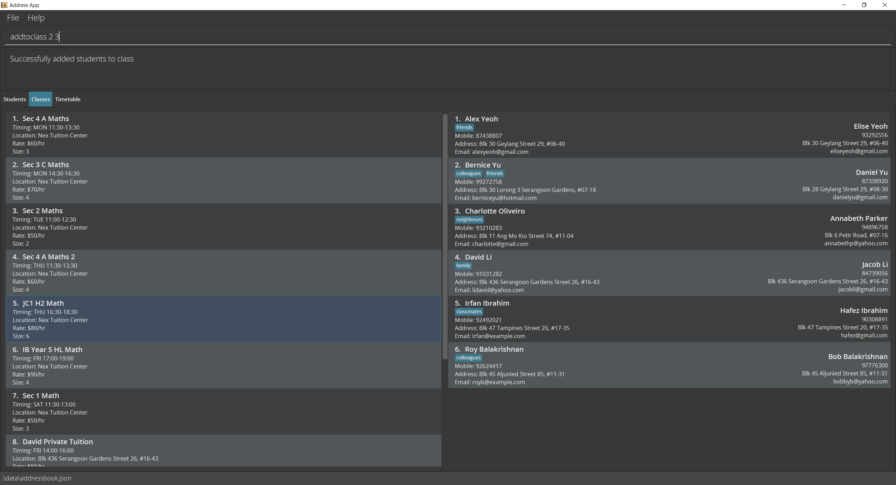
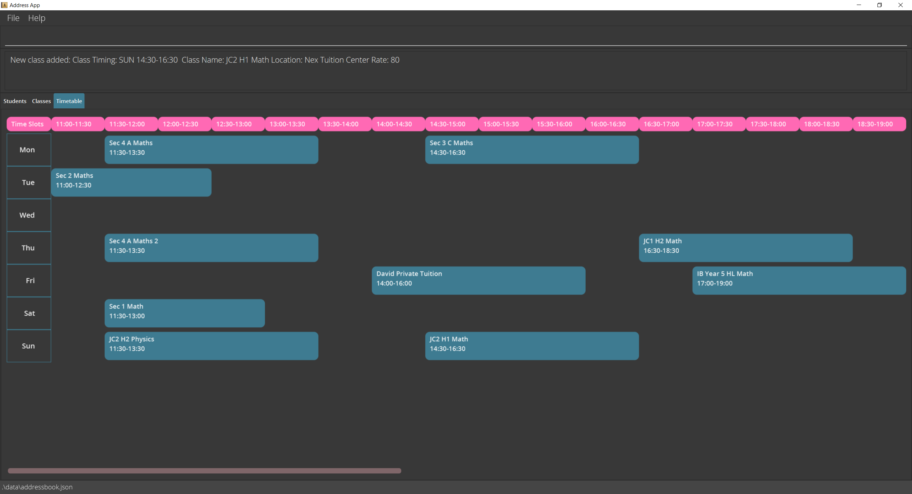

**TimesTable is a desktop app for managing your tuition students and classes, optimized for use via a Command Line Interface (CLI) while still having the benefits of a Graphical User Interface (GUI).**
While it has a GUI, it can be controlled by typing in commands using the CLI.
If you can type fast, TimesTable can get your class management tasks done faster than traditional GUI apps.

* If you are interested in using TimesTable, head over to the [_Quick Start_ section of the **User Guide**](UserGuide.html#quick-start).
* If you are interested about developing TimesTable, the [**Developer Guide**](DeveloperGuide.html) is a good place to start.

# Features

### Student Management

TimesTable supports all basic contact management commands such as adding of students and their contact info, editing of contact info,
deleting students, finding students, sorting, etc. Furthermore, TimesTable also stores the Next-of-Kin(NOK) information of the student,
which is important and often used. This is displayed to the right of the student information.

### Class Management

TimesTable allows users to easily create and manage their classes. The Class tab shows all the information
about your various classes at a glance, with the student information in the sidebar on the right. Users can 
easily add and remove students from the various classes using the commands. The class list can also be filtered
to search for a  specific class.

### View Timetable

TimesTable automatically generates a timetable for you based on the classes that you have added.
Simply head over to the Timetable tab by clicking on it or using the view command.

**Acknowledgements**

* Libraries used: [JavaFX](https://openjfx.io/), [Jackson](https://github.com/FasterXML/jackson), [JUnit5](https://github.com/junit-team/junit5)
* The [`Timetable`](#view-timetable) feature was inspired by a similar feature in the past project of [Pet Store Helper](https://github.com/AY1920S2-CS2103-W15-4/main) ([DG](https://ay1920s2-cs2103-w15-4.github.io/main/DeveloperGuide.html#calendar-feature)). 
  The implementation of the components of the Timetable feature (`TimetableTuitionClassSlot`, `TimetableDay`, `TimetableRegion` and `TimetableEmptySlot`) has been adapted from them with maximum changes to fit our app.
  The implementation of how we built and designed ([TimetablePanel.java](https://github.com/AY2122S1-CS2103T-F11-1/tp/blob/master/src/main/java/seedu/times/ui/timetabletab/TimetablePanel.java)) the entire Timetable Tab (layout, classes etc) is entirely new.
